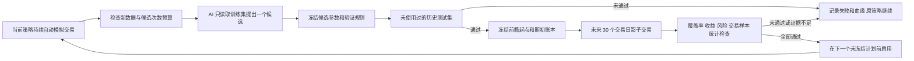

# A 股模拟交易系统：AI 策略改进与前瞻验证实现方案

> 状态：待实施（设计方案）。
> 创建日期：2026-10-10。
> 设计依据：[94bd75e](https://github.com/sanchez0623/ashare-limit-lens/commit/94bd75e83ecfa21297c3427461ea9bc722660d07)。
> 文档入口：[统一索引](../README.md)。

本方案针对 `ashare-limit-lens` 当前代码，属于设计交付，尚未修改交易代码或部署。目标是保留自动模拟交易，用完整血缘、一次性测试样本、候选次数预算和事前冻结的影子交易，约束 AI 参数的自动启用。收益可按账本重放验证；这不等于承诺候选未来盈利。

多候选并行扩展见 [多策略赛马方案](multi-strategy-tournament.md)。该模式需要新的事前研究政策：一个冻结候选批次共享一次测试窗口，各候选分别登记尝试与统计预算，并共用全局活动窗口；启用前本文件的单候选规则继续适用。

## 1. 最终运行方式



“自动改进”表示系统自动提案、验证和按规则启用。历史回测通过后，主账户仍使用原策略，直到前瞻验证完成。AI 不能修改资金、费用、执行代码、硬风控、样本划分或验证结论。

保持现有资金默认 100 万元及可配置费用：佣金率 0.00005、最低佣金 5 元、卖出印花税 0.0005、双边经手费 0.0000341、证管费 0.00002、过户费 0.00001。费用参数与研究参数分开；任何费用变更均留档，且影响正在验证的候选资格。

## 2. 现有代码的改动位置

| 当前文件                          | 当前行为                                               | 目标改动                                                                     |
| --------------------------------- | ------------------------------------------------------ | ---------------------------------------------------------------------------- |
| `backend/services/improvement.js` | 20 日训练、10 日历史验证，通过后可直接启用             | 保留训练集 AI 提案能力；将预留窗口、验证、影子开户和启用交给研究服务         |
| `backend/domain/validation.js`    | 检查参数范围；3 笔成交和收益门槛                       | 加入实际变化数量、变化幅度限制；历史验证支持指定期初账本；前瞻验证另建纯函数 |
| `backend/storage/paper.js`        | `versions()` 最多 40 条；`activate()` 接受 `VALIDATED` | 展示分页与全历史规则查询分开；启用统一经过前瞻报告、父策略与环境一致性检查   |
| `backend/services/realtime.js`    | 只轮询主账户订单和持仓                                 | 行情采集独立运行，联合采集主账户、各影子账户与固定基线需要的股票             |
| `backend/storage/realtime.js`     | 主账户状态、行情、成交一次 CAS 提交                    | 兼容旧主账户记录；新增全局行情帧和各账户消费游标，分账户原子提交             |
| `backend/services/paper.js`       | 结算后改进，再冻结下一日计划                           | 结算各账户、推进研究状态、检查启用资格，最后冻结各自下一日计划               |
| `backend/routes/api.js`           | 改进与启用接口                                         | 增加研究查询、配置、导出接口；旧启用接口也执行完整规则                       |
| `frontend/paper.js`               | 展示历史验证及启用按钮                                 | 展示完整研究阶段、进度、对照净值、失败原因和血缘；历史通过不提供直接启用按钮 |
| `db/schema.ts`、`drizzle/`        | 现有财务与策略表                                       | 追加迁移；保留原账本、原迁移和旧数据的重放方式                               |

项目仍使用当前 JavaScript ESM、JSDoc、Node 测试、SQLite/D1，不为这次改动切换框架或增加独立微服务。

## 3. 数据划分和“新数据”的准确规则

### 3.1 默认窗口

- 训练：60 个交易日，可事前配置为 60～120 日。
- 历史测试：20 个交易日，可事前配置为 20～60 日。
- 前瞻影子：30 个交易日，可事前配置为 20～90 日。
- 每月最多发起 1 次模型提案；同一研究空间同时只允许一个未结束的验证窗口。
- AI 调用、参数不合规、历史失败、前瞻失败均记录为尝试，不重新挑选成功样本。

以上是建议初始值，均属于新研究规则，不能改写已经冻结的实验。主账户资金与费用继续由现有设置管理。

### 3.2 允许训练重叠，禁止测试复用

每个样本记录：

```js
const sample = {
  decisionDate, // 事前评分所属日期
  tradeDate, // 被评估收益所属交易日
  labelEndDate, // 多日标签的最后收益日期
  availableAt, // 该标签实际可获得时间
  snapshotDigest,
  marketDigest,
  quoteManifestDigest,
};
```

测试日期以收益标签涉及的交易日登记，而不是简单按快照日期登记。测试可以使用过去已知的特征，但不能使用未来标签。

1. 新测试收益日期不得与历史任何已登记的训练、测试或参数选择日期重叠。
2. 以前的测试数据允许进入以后训练集，但不得再次充当测试集。
3. 改了数据哈希、策略名称、费用版本、模型或研究规则，不会让同一日期重新变成新测试数据。
4. 失败、错误、中止实验的样本占用不删除；检查读取数据库全历史，不能使用 UI 最近 40 条版本列表。
5. 主账户每日复盘不自动等于参数训练；一旦复盘内容被用于选择候选、规则或参数，就必须登记为 `SELECTION`。历史测试不得进入提案提示词或其会话记忆。

示例，数字表示交易日序号：

| 实验 | 训练    | 历史测试 | 参数冻结      | 前瞻测试 |
| ---- | ------- | -------- | ------------- | -------- |
| A    | 1～60   | 61～80   | 第 80 日盘后  | 81～110  |
| B    | 51～110 | 111～130 | 第 130 日盘后 | 131～160 |

这里 B 的训练使用 A 的旧测试数据是正常的时间推进；B 的测试全部是新日期。61～80 虽然是未发送给提案模型的历史样本，仍然只是历史筛查；81～110 才是冻结候选之后真正到来的前瞻样本。

历史测试还必须晚于父策略和验证政策的信息截止日期。不能先看某段历史表现、修改验证规则，再把该段数据称作未见测试。自动系统使用独立、无浏览工具的提案请求，只传训练集；人工决策涉及的数据需登记，系统无法自动证明人从未看过行情。

### 3.3 标签跨边界处理

当前下一交易日收益标签按实际可用时间划分，训练最后一天的结果已知之后才能使用；不能把“最长持仓 5 日”直接当作“标签一定跨 5 日”。将来若训练标签是未来 5 日收益，应剔除标签区间跨入测试区间的训练样本。额外隔离期按标签和数据发布时间事前确定，不任意增加或在结果出来后调整。

### 3.4 窗口固定，不能择时结束

前瞻阶段按确认的市场交易日计数，不按“采集成功天数”计数。30 日中发生缺失，不能自动延长到收益变好；本次标记无效或证据不足。休市不计入。

提前盈利不允许提前通过。预先规定的硬风控可以提前标记失败并停止新增仓位，但原定测试窗口仍占用到结束；已有持仓和未完成 T 按风控规则处理。修改费用、代码或父策略导致失效，也不能缩短原窗口、释放已有测试日期后再试。

## 4. 参数限制、完整血缘与实验状态

### 4.1 参数约束必须由代码执行

保留当前允许字段与范围，额外检查“相对父策略的实际变化”。相同值不计修改，无实际变化拒绝。

| 参数                                | 建议单次最大变化                              |
| ----------------------------------- | --------------------------------------------- |
| `minScore`、`minSectorScore`        | 2 分                                          |
| `maxPositions`、`maxHoldDays`       | 1                                             |
| `stopLoss`                          | 0.005，即 0.5 个百分点                        |
| `takeProfit`                        | 0.01                                          |
| `maxBuyGap`、`tBuyDip`、`tSellRise` | 0.005                                         |
| `tFraction`                         | 0.02                                          |
| `weights`                           | 最多改 2 个分量，每个最多 2；保持权重总和不变 |

每次最多改 2 个逻辑参数组，`weights` 算一个组。拒绝未知字段、原型相关字段、非有限数值和越界值。资金、费用、滑点、参与率、仓位硬上限、T+1、验证规则与代码均不在 AI 权限内。不能仅在 system prompt 写“小幅修改”。

### 4.2 血缘清单

每次尝试预留后就建立实验记录，成功失败均保留：

```js
const lineage = {
  experimentId,
  researchNamespace,
  attemptSequence,
  parentStrategyId,
  parentParamsDigest,
  fixedBaselineId,
  fixedBaselineDigest,
  candidateStrategyId,
  candidateParamsDigest,
  patch,
  policyId,
  policyDigest,
  trainingManifest,
  historicalManifest,
  forwardWindowRule,
  reservedAt,
  requestIssuedAt,
  candidateFrozenAt,
  approvedAt,
  scheduledAt,
  effectiveTradeDate,
  modelAlias,
  modelVersionReported,
  promptDigest,
  validatedResponse,
  rationale,
  feeConfigVersion,
  feeConfigDigest,
  openingBookDigest,
  openingEquityCents,
  executionVersion,
  scoringVersion,
  sourceDigest,
  lockfileDigest,
  captureUniverseVersion,
  statisticalSeed,
  statisticalConfig,
  historicalReportDigest,
  forwardReportDigest,
};
```

不记录 API Key、Authorization、带认证的 URL、环境变量或未经筛选的供应商响应。真实模型版本无法获得时明确记为未知，不自行伪造。记录模型输出与最终参数，而不是依赖将来重新调用大模型得到同一回答。

上面的对象是组合后的血缘视图，不是一个不断改写的冻结 JSON。预留清单、提案清单、前瞻期初清单、最终报告和启用事件分别不可变，按摘要关联；批准和生效时间来自后续追加事件。候选参数在历史测试前冻结；前瞻期初账本在历史通过后、第一日前瞻交易前另行冻结，不回写提案清单。

事件使用规范 JSON、前一事件哈希和当前事件哈希形成可核对链。哈希提供一致性校验，不声称能防止拥有数据库全部写权限的人重写整条链；需要独立证明时再增加外部签名或独立归档。

### 4.3 状态流转

```text
PROPOSING -> HISTORICAL_CHECK -> SHADOWING -> EVALUATING
                                            -> APPROVED -> SCHEDULED -> PROMOTED

失败终态：REJECTED / ERROR / INCONCLUSIVE / INVALIDATED
```

- `REJECTED`：参数、历史筛查或预定风险/收益检查明确未通过。
- `ERROR`：模型调用、持久化或处理错误，尝试仍留档。
- `INCONCLUSIVE`：交易样本或统计证据不足，不等于验证通过。
- `INVALIDATED`：行情缺失，或费用、政策、执行环境、父策略变更。
- 研究阶段与策略版本的 `ACTIVE/RETIRED` 分开；“历史通过”不具有启用资格。
- 中途标记失败的窗口仍保留日历占用；释放活动实验名额以原定窗口结束为准。

## 5. 数据库设计

延续“查询必需字段列式存储、复杂清单 JSON 存储”，金额统一使用整数分，交易日期使用北京时间，时间戳使用 UTC。

| 新表                       | 关键字段与约束                                                                                                                                        | 用途                                                                   |
| -------------------------- | ----------------------------------------------------------------------------------------------------------------------------------------------------- | ---------------------------------------------------------------------- |
| `research_policy_versions` | `id PK, created_at, effective_at, payload, digest`                                                                                                    | 不可变研究政策                                                         |
| `research_registry`        | `namespace PK, revision, attempt_sequence, legacy_cutoff, selection_cutoff, last_run_id`                                                              | 全历史研究计数及保守信息截止线；不因政策更新清零                       |
| `research_experiments`     | `id PK, namespace, parent_version, candidate_version, policy_id, stage, revision, frozen_at, reservation_payload, proposal_manifest, proposal_digest` | 候选、不可变提案清单与事件入口                                         |
| `research_budget_slots`    | `(namespace, month, slot) PK, experiment_id UNIQUE`                                                                                                   | 并发下原子占用月度提案次数                                             |
| `research_active_slots`    | `namespace PK, experiment_id UNIQUE, window_payload`                                                                                                  | 一个活动验证窗口；失败不提前释放                                       |
| `research_sample_uses`     | `namespace, experiment_id, role, outcome_date, sample_key, payload, digest`；唯一组合键；索引 `(namespace, outcome_date, role)`                       | 记录 `TRAIN/HISTORICAL_TEST/FORWARD_TEST/SELECTION` 每次使用与标签区间 |
| `research_test_claims`     | `(namespace, outcome_date) PK, experiment_id, role, reserved_at`                                                                                      | 测试日期的全局一次性占用                                               |
| `research_events`          | `(experiment_id, sequence) PK, event_type, created_at, payload, previous_digest, digest`                                                              | 追加式状态、失败、启用与回退记录                                       |
| `research_reports`         | `(experiment_id, stage) PK, payload, digest`                                                                                                          | 历史和最终前瞻报告，完成后不覆盖                                       |
| `quote_frames`             | `(trade_date, sequence) PK, captured_at, universe_digest, payload, digest`                                                                            | 全局不可变行情输入，包含缺失与采集错误                                 |
| `quote_capture_state`      | `id PK, revision, last_sequence, producer_lease, last_run_id`                                                                                         | 行情生产者租约与序号，避免多执行器重复采集提交                         |
| `shadow_accounts`          | `id PK, experiment_id, role, revision, initial_book, state, last_frame_date, last_frame_sequence, last_run_id`                                        | 候选、父策略、固定基线及持续固定基线的独立账本                         |
| `shadow_plans`             | `(account_id, signal_date) PK, payload, digest`                                                                                                       | 各影子组合冻结计划                                                     |
| `shadow_sessions`          | `(account_id, trade_date) PK, payload, digest`                                                                                                        | 会话与未完成订单                                                       |
| `shadow_ledger`            | `(account_id, id) PK, trade_date, payload`                                                                                                            | 分账户成交，避免现有成交 ID 冲突                                       |
| `shadow_equity`            | `(account_id, trade_date) PK, payload, digest`                                                                                                        | 各账户净值、费用、风险与完整性                                         |

每个多日标签展开登记它占用的收益日期，同时保留原样本信息。日期登记负责不可复用，数据哈希负责可重放，两者不能混为一个键。测试新颖性与尝试序号属于全局研究空间，不能通过新建账户别名或政策版本绕过。

策略参数继续存在 `strategy_versions`。新候选创建时写入参数和实验引用，冻结后只允许变更运行状态，不覆盖参数；父策略 ID 始终可追溯。

原子预留按下面顺序在一个事务/带 nonce 的原子 batch 内完成：检查 registry revision → 占用活动窗口与月度名额 → 增加全局尝试序号 → 写训练使用和历史测试日期占用 → 建立实验及首个事件。任一占用冲突则整次预留失败，且不调用大模型。

SQLite 使用事务；D1 使用当前项目已有的 revision/CAS 与 nonce 守卫 batch 模式。不能先插部分占用、失败后再删除补救。测试日期插入前检查历史 `research_sample_uses` 的训练/选择占用；活动窗口唯一约束与全局 registry CAS 防止并发检查后交叉写入。

UI 分页查询与安全检查分离：例如 `listExperiments(cursor, limit)` 供展示，`assertFreshOutcomeDates(namespace, dates)` 直接查全量索引；不能复用带 `LIMIT 40` 的展示函数。

## 6. 影子账户和行情执行

### 6.1 对照组合

每个实验历史通过后，在同一个已结算时点复制主账户，创建三个匹配组合：

1. 候选策略组合。
2. 冻结的当前父策略组合。
3. 固定初始策略组合，参数读取原 `baseline-v1` 并永久固定。

三者复制相同现金、持仓批次、买入日期、成本、估值、历史风险峰值、未完成减仓/清仓及 T 的补腿。不能让候选从空仓 100 万开始、父策略却带着已有浮亏比较。收益和窗口回撤另以实验期初权益计算，不重置交易引擎已有风险峰值。

此外保留一个从本次升级可验证起点连续运行的固定基线账户，用于观察长期自适应路径。实验内匹配的固定基线和长期连续基线明确区分；没有旧行情记录时，不伪造从最初上线开始的基线业绩。

固定的是策略参数；全局所有者费用/执行规则变化另留版本。在同一实验中费用和执行环境必须一致；变化则本次验证失效。持续固定基线与主账户按同一全局配置时间表运行。

### 6.2 复用现有执行引擎

不为影子账户另写一套简化成交算法。复用：

```js
createPlan(snapshot, book, strategy, version, createdAt);
openSession(book, frozenPlan, tradeDate);
advanceSession(book, session, observation);
closeSession(book, session, endOfDayDataset);
```

保留现有 T+1、FIFO、100 股买入单位、成交量参与率、滑点、费用、止损、未完成 T 延续和拒绝陈旧报价规则。每个组合是同样行情下独立的假设路径，不和主账户互相争抢模拟成交量。代码改变时新执行版本必须显式登记；不能以新引擎悄悄重算旧记录。

历史筛查扩展现有 `replayStrategy`，支持明确的 `initialBook`、执行版本与会话/续单起点。历史期初账本优先从当时主账户的账本前缀重建；否则由父策略在训练段的合格行情上预热得到。双方复制同一份起点，不能从后来主账户状态倒推。如果起点或行情无法重建，本次不能宣称历史覆盖完整。

### 6.3 一次采集、多账户消费

```text
腾讯短连接轮询，目标间隔 10 秒
             ↓
  全局不可变 quote_frame
             ↓
  主账户 + 候选 + 父策略 + 固定基线，各自有消费游标
```

采集股票池为所有上述账户的持仓、保护订单、冻结计划的并集；持仓不需要继续涨停才会被采集。

历史筛查还有一个实际前提：仅保存主账户买过的股票，不足以检验可能选了其他股票的候选。为积累可验证历史，建议预先保存“上一交易日冻结涨停样本全集 + 各账户持仓/订单”的行情；按腾讯接口当前批次能力拆批，每个批次记录时间。也可设置较小的预声明研究池，但候选需要池外股票时必须判定覆盖不足，不能事后补造行情或按日线假装成交。

优先复用现有 `tradingQuotes`，不为每个影子账户重复发请求。轮询有在途请求时不启动重叠轮次；10 秒是目标采样周期，不用服务器时间反推缺失成交。只存规范化的执行必需行情、实际报价时间、采集时间和缺失项，不保存认证请求头。

采集不再被“主账户已结算/上一日结算阻塞”直接阻断：各账户分别判断能否消费，行情仍可供合格影子组合使用。

每个账户一次提交包含：期望 revision 和游标检查、更新账本、会话、成交记录和消费游标，全部原子完成。行情帧先持久化，各账户随后独立消费；不强求多个账户在一个巨大事务里提交。

恢复时只处理已落盘但尚未消费的有序帧，按照原采集时间运行纯执行函数，不拿恢复后的时间替换。中断期间没有采集的行情不能事后补成实时成交。若程序在落盘后、部分账户消费前崩溃，可以确定性恢复该部分帧，但恢复迟延记录会进入健康报告；启用前要求主账户与影子游标已追平。

现有主账户表和财务导出继续兼容。主账户财务重放所需的观察序列可继续写现有 `paper_live_ticks`，新增全局帧则作为研究输入；二者通过帧引用校验一致。后续再考虑去重存储，不在首次改造中迁移全部旧财务主键。

Windows 常驻进程仍负责盘中轮询、研究任务和盘后结算；网页只展示与配置。不能把本地 SQLite 和网站 D1 误当作同一个账户；每个导出带账户与研究空间标识。本次验证与交易必须由同一权威常驻进程和同一数据空间驱动。

### 6.4 盘后顺序

1. 获取各账户需要的当日收盘数据，确认交易日。
2. 确认账户已消费该日已落盘行情；分别结算，保持现有幂等性。
3. 追加影子净值、覆盖率和交易样本，更新前瞻日历计数。
4. 达到预定结束日时生成一次最终报告；中途报告只供观察，不用于通过。
5. 执行符合条件的策略启用；若当日下一日计划已冻结，排到下一次可生成新计划的边界。
6. 为主账户、活动影子账户和持续基线分别冻结下一日计划。
7. 主交易流程完成后异步检查是否可以预留新的研究提案。模型延迟或研究异常不阻塞主账户生成计划；历史筛查通过后的影子组合仅从下一份确实事前冻结的计划开始，不补过去交易。

## 7. 收益评价与启用规则

### 7.1 可核对的基础指标

```text
期末权益 = 现金 + 持仓按实际收盘价估值
实验收益率 = 期末权益 / 实验期初权益 - 1
每日收益率 = 当日权益 / 前一日权益 - 1
窗口回撤 = 1 - 当日权益 / 窗口内截至当日权益峰值
```

影子开户继承了旧持仓，所以核对实验盈利时必须使用“期间已实现盈亏增量 + 期末未实现盈亏 - 期初未实现盈亏”，不能直接用累计已实现盈亏。现有成本账本已经计入费用时，不再重复减一次手续费；费用增量单独列示。

“完整交易轮次”按一只股票从零持仓建仓到再次归零统计。加减仓和 T 的多笔成交不算多次独立轮次；继承的期初持仓平仓不冒充本期完整新建仓轮次。未平仓部分依然计入权益，不为凑次数强制平仓。

### 7.2 历史筛查

历史筛查是经济与执行合理性过滤：窗口合格、成交可重放、费用一致、候选收益/风险未明显恶化。初始可沿用净收益相对父策略至少 +0.1 个百分点、回撤相对最多恶化 0.5 个百分点且不越过 10% 的门槛，但它只有进入影子阶段的资格，没有直接启用权。

### 7.3 前瞻启用检查

全部条件在提案前的政策中冻结：

- 原定前瞻交易日已经全部结束，候选与两个匹配对照使用同一段可验证行情。
- 执行所需报价、事前快照和收盘数据满足完整性规则，不存在用历史行情补实时成交。
- 建议候选与父策略各至少 10 个完整新交易轮次；不足记 `INCONCLUSIVE`，不靠延长本次窗口凑数。固定基线若按规则未交易可合法持有现金，并明确显示其活动度。
- 候选净收益相对父策略至少高 0.1 个百分点，并且不低于匹配固定基线；没有成交摩擦前后的混用。
- 候选窗口回撤不超过 10%，相对父策略不恶化超过 0.5 个百分点；现有主账户硬风控仍独立生效。
- 相对父策略、匹配固定基线的配对日收益差，通过预先登记的统计检查。
- 父策略、费用、执行、评分、股票池政策与研究政策指纹符合本次冻结要求；主账户和影子结算已追平。

初版不把年化收益或短样本夏普比率设为核心通过门槛；可以展示，但不能用单个漂亮数值替代以上检查。

### 7.4 对多次尝试的处理

限制提案次数只能减少机会，不自动消除多次选择问题。增加全历史尝试序号 `k`，对每次尝试分配统计误差预算：

```text
alpha_k = 0.05 / [k × (k + 1)]
每个对照的单侧 alpha = alpha_k / 2
所有 k 的 alpha_k 总和不超过 0.05
```

失败和模型错误也占用序号，保守处理。计数不因月份、年份、父策略、模型或政策变更清零。

使用确定性随机种子，对候选与对照的每日对数收益差做配对、按日期的循环区块 bootstrap，建议区块长度 5 日。两个对照使用同一次日期重采样。区块长度、种子、对照数量、误差预算和重采样次数在实验前确定；不能看结果后挑统计方法。

重采样次数预先取 `max(10000, ceil(50 / alphaPerComparison))`，最多 100 万；超过计算预算则证据不足，不降低门槛。统计工作放在常驻程序的分片任务中，不阻塞 10 秒交易循环，并按输入/政策哈希恢复进度。

保守检查各对照收益差的单侧置信下界大于 0，并满足经济门槛。短窗口和非平稳市场下 bootstrap 只是近似证据；上述预算只有在检验本身有效的前提下才具有相应错误控制含义，不能声称由这段代码数学保证永不过拟合。样本不足时保持原策略；若要改成 60/90 日，必须用于新的事前登记实验。

### 7.5 所有启用入口使用同一服务

```js
promoteCandidate({ experimentId, expectedAccountRevision, nextUnfrozenPlan });
```

启用服务重新读取数据库并检查：最终报告的通过结论与哈希、实验参数与清单、父策略仍为当前策略、费用和执行版本相容、候选未失效、启用时点合格、账户 revision 正确。检查和更新在同一带 CAS 的原子提交中，人工按钮不能绕过。

启用只变更用于后续新计划的策略指针和策略状态，不把影子持仓复制到主账户，不重置现金、持仓成本、风险峰值或历史盈亏。已冻结计划与未完成 T 按其冻结规则执行，不能被新参数追溯改写。

候选获准后若等待期间出现配置/父策略变化则失效；可事前设置最多等待 2 个交易日，否则需要新试验。回退也只在下一份可冻结计划前恢复旧参数，保留切换期间真实模拟亏损。硬风控的风险处置继续即时由现有引擎执行。

## 8. 模块、函数契约与关键伪代码

```text
backend/domain/
  research-policy.js       政策、候选次数及参数步长的纯校验
  research-windows.js      样本区间、信息可用时间、purge、测试新颖性
  research-lineage.js      规范 JSON、清单及事件摘要
  research-statistics.js   配对区块重采样和确定性统计
  research-promotion.js    从冻结政策和最终报告计算通过原因
  validation.js           复用并扩展历史重放入口

backend/storage/
  research.js             原子预留、全历史日期检查、状态 CAS、追加事件
  shadow.js               分账户计划、会话、账本、游标、结算
  quote-stream.js         全局行情帧、生产者租约与有序读取

backend/services/
  improvement.js          无会话的训练集提案，严格校验模型输出
  research.js             实验编排、最终报告与启用协调
  shadow.js               创建匹配组合、推进交易、盘后关闭
  quote-stream.js         腾讯采集与行情帧持久化
  realtime.js             调度采集和各账户消费
  paper.js                主账户结算与计划冻结

shared/research-status.js  DTO 枚举及中文标签，不放后台验证逻辑
frontend/research.js       研究面板与血缘查询
scripts/verify-research.mjs 离线重放、指标、日期及启用检查
test/research-*.test.mjs   防泄漏、并发、生命周期、统计与重放测试
```

关键纯函数：

```js
validateResearchPolicy(input);
validateCandidatePatch({ proposal, parentParams, frozenPolicy });
selectCausalWindows({ samples, informationCutoff, policy });
purgeCrossingLabels({ training, testOutcomeDates });
buildLineageManifest(input);
calculateWindowMetrics({ initialBook, equities, ledger });
countCompletePositionCycles({ initialBook, ledger });
pairedBlockBootstrap({ pairedDailyReturns, seed, blockLength, iterations });
evaluateForwardReport({ policy, manifest, coverage, metrics, statistics });
checkPromotionEligibility({ experiment, report, currentAccount, environment });
```

仓储负责新颖性查询与并发约束，纯函数负责给定事实的检查，服务负责排序和调用。不把 HTTP、SQL 或大模型调用放入统计/交易纯函数。

一次提案：

```js
async function proposeImprovement(context) {
  if (!context.aiConfigured) return { status: "NOT_CONFIGURED" };
  const eligible = await researchRepo.prepareEligibleWindows();
  if (!eligible.ready) return eligible.reason; // 不消耗预算

  // 原子预留先于模型调用；内部重新检查全历史与版本。
  const experiment = await researchRepo.reserveAttempt(eligible);
  const requestId = await researchRepo.markRequestIssued(experiment.id);
  try {
    const output = await proposer.request({
      parent: experiment.parentParams,
      trainingOnly: experiment.trainingInput,
      requestId,
    });
    const candidate = validateCandidatePatch({
      proposal: output,
      parentParams: experiment.parentParams,
      frozenPolicy: experiment.policy,
    });
    await researchRepo.freezeCandidate(experiment.id, candidate);
    const report = await replayHistoricalComparison(experiment.id);
    await researchRepo.appendHistoricalReport(experiment.id, report);
    if (!report.passed) return researchRepo.reject(experiment.id, report);

    // 复制同一闭市账本；起始日必须仍能事前冻结各自计划。
    return shadowService.scheduleMatchedPortfolios(experiment.id);
  } catch (error) {
    return researchRepo.recordTerminalError(experiment.id, safeError(error));
  }
}
```

调用成功后先持久化经筛选的输出，再跑本地验证。进程若在已发请求但响应未持久化时崩溃，状态标为错误，不重新调用以挑更好参数。已存输出和本地验证可幂等恢复。多个并发入口只能成功预留一个实验。

盘中：

```js
async function pollAllPortfolios(now) {
  const portfolios = await portfolioRegistry.eligiblePortfolios(now);
  // 只根据冻结的窗口规则与交易日历登记，先于读取当天行情结果。
  await researchRepo.materializeForwardDatesBeforeObservation(now);
  const universe = await buildPredeclaredQuoteUniverse(portfolios, now);
  const frame = await quoteStream.captureAndPersist(universe, now);
  // 行情只取一次，逐账户独立原子消费，出错不覆盖其他账户。
  for (const portfolio of portfolios) {
    await portfolioRunner.consumePersistedFrames(portfolio.id, frame.key);
  }
}
```

盘后研究推进：

```js
async function advanceResearchAfterClose(date) {
  // 恢复漏跑日期时按原窗口规则补齐日历计数；缺失输入仍记无效。
  await researchRepo.reconcileScheduledWindowCalendar(date);
  await shadowService.settleEligiblePortfolios(date);
  const experiments = await researchRepo.windowsEndingOrAdvancing(date);
  for (const experiment of experiments) {
    if (!experiment.windowEnded) continue;
    const report = await researchEvaluator.finalReport(experiment.id);
    await researchRepo.storeFinalReportOnce(experiment.id, report);
    if (report.passed) await promotionService.schedule(experiment.id);
  }
}
```

实际前瞻日期占用应在当日首次采集/消费前登记；盘后日历核对只能按原定规则补登记漏跑的日期并记录缺失，不能选择跳过亏损日或改窗口。

## 9. 接口和前端

| 接口                                            | 功能                                                       |
| ----------------------------------------------- | ---------------------------------------------------------- |
| `GET /api/research/status`                      | 当前规则、活动实验、进度、月度预算、全局尝试序号及下次资格 |
| `GET /api/research/experiments?cursor=...`      | 所有成功/失败尝试的游标分页                                |
| `GET /api/research/experiments/:id`             | 实验清单、最终/中间指标、逐项检查原因                      |
| `GET /api/research/experiments/:id/lineage`     | 父子关系、样本清单、摘要与完整事件                         |
| `GET /api/research/experiments/:id/performance` | 匹配组合的同日起点净值、费用、回撤、成交轮次               |
| `POST /api/research/propose`                    | 启动一个符合规则的实验；幂等键不能绕过次数限制             |
| `POST /api/research/policy`                     | 新建不可变规则版本，只对以后实验生效                       |
| `POST /api/research/experiments/:id/promote`    | 请求排期；必须通过完整启用检查                             |
| `GET /api/research/export`                      | 导出可核对清单、行情、账本、政策、统计及事件               |
| `POST /api/research/verify`                     | 校验本机已有导出/实验；大文件由离线脚本处理                |

保留 `/api/paper/improve` 和 `/api/paper/activate` 兼容入口，分别代理新服务。现有 ID 正则需支持新的有长度限制的不透明实验/版本 ID，也能识别旧 `ai-YYYY-MM-DD`；识别旧 ID 不代表放开启用规则。

所有写接口沿用当前所有者认证、同源保护、JSON 大小限制和参数白名单。前端只接收展示 DTO，不接收 Key 或供应商认证信息；输出文本转义，AI 理由不作为 HTML 渲染。禁止直接改测试标签、统计结果或账本的接口。

页面明确展示：训练日期、历史测试日期、真正前瞻日期、冻结时间、已过交易日/固定目标日数、持仓与现金、三个匹配净值、持续固定基线、成本、失败/不足原因及规则版本。历史通过显示“进入前瞻验证”，不能显示“收益已证明”。

中途净值可以看，但界面不提供“本次延长”“改参数继续本次验证”“忽略缺失强制通过”等按钮。每日 AI 解释性评分单独展示，不能成为覆盖代码验证结果的启用开关；结束后的报告才可作为以后训练输入，并登记样本使用。

## 10. 迁移、部署与可验证导出

1. 新增 Drizzle 迁移，不修改已有 0000～0003 迁移，不删除主账户成交或净值。
2. 当前 `ACTIVE` 策略继续执行，不因研究数据不足停止交易。
3. 遍历全部历史 `strategy_versions`，回填已知训练/测试日期和父子关系；无法证实的字段记未知，不捏造血缘。
4. 老 `VALIDATED` 标记为 `LEGACY_VALIDATED` 或等效资格标志，不能直接手动/自动启用。重新参与必须使用新试验与新日期。
5. 建立保守的 `legacy_cutoff`：至少覆盖迁移时最后已结算日及所有已知历史研究日期。不允许将迁移前信息重新叫作新测试；历史未知次数记录已知下界和不完整性，新统计预算明确从可审计的新流程开始，不能宣称覆盖未记录的旧研究。
6. 固定原始基线参数；从可验证的升级起点初始化持续基线；开始积累完整行情和因果快照。缺 60+20 日合格数据时，主交易照常、研究显示积累中。
7. 本地 Windows 常驻服务执行实时任务和统计分片。部署代码版本、迁移状态、运行模式、账户标识写入健康面板；网站单独运行不声称有秒级后台轮询。

研究导出至少包含：完整实验与政策历史、所有失败尝试和占用日期、期初账本、每个组合的事前计划、原始规范化行情帧、收盘数据、成交、净值、统计输入与种子、启用事件、摘要及执行代码版本。

导出先原子捕获研究/账户 revisions、各账户状态与行情消费游标、事件截止序号，再分块导出截止点之前的追加式记录。进行中的组合明确给出各自游标，不把不同处理进度拼成同一时点。最终报告引用的已结束实验输入固定不变。导出包含这些检查点，避免盘中跨次读取产生账本与行情不一致的文件。

`verify-research.mjs` 在本地依次检查：摘要和事件链 → 样本区间与新颖性 → 逐帧财务重放 → 期间收益/费用/回撤 → 相同种子的统计计算 → 逐项启用资格。主账户长期收益使用其连续账本，不拼接每次最佳影子区间。导出不能只包含最后 40 个策略版本。

验证须使用与清单匹配的执行源码/依赖版本；支持版本注册表或检出对应 Git 提交。遇到不支持的版本明确失败，不能用最新代码近似重放后宣称一致。保存源码摘要，并可独立归档公开的最小验证源码包；不加载导出中的任意可执行字符串。

规范化行情按交易日存储，盘中不删；已参与研究的数据只做压缩归档，保留摘要和可恢复路径，不因滚动保存最近 N 天而失去审计证据。

## 11. 验证用例和实施顺序

### 11.1 必须通过的测试

| 类别         | 关键验证                                                                                                    |
| ------------ | ----------------------------------------------------------------------------------------------------------- |
| 数据隔离     | AI 请求只含训练集；历史/前瞻测试不进入上下文；标签发布时间和跨窗口标签被检查                                |
| 日期新颖性   | 与旧训练/测试/失败/选择日期重叠均拒绝；旧测试成为新训练允许；哈希更换不能复用日期；第 41 条以前的记录仍生效 |
| 候选限制     | 超过 2 个参数组、幅度过大、非法权重、费用/资金/硬风控修改和无变化候选均拒绝                                 |
| 预留并发     | 两次同时提案只有一次预留和模型调用；错误仍耗预算；请求后崩溃不自动再调用；全局序号不随政策变更清零          |
| 匹配起点     | 非空持仓、T+1 批次、期初未实现盈亏、未完成正反 T 被完整复制；收益与费用增量不重复累计                       |
| 联合行情     | 候选所需股票不在主账户中仍被轮询；持仓不涨停仍被轮询；缺失不回填成成交                                      |
| 恢复与幂等   | 帧落盘后崩溃、某账户提交后崩溃、重复 EOD 和 CAS 冲突均不重复成交；有序游标与账本一致                        |
| 前瞻固定窗口 | 历史通过不启用；中途盈利不提前通过；缺失日仍计入目标日数；不延长到盈利；中止窗口不提前释放                  |
| 统计         | 种子和结果可重现；相同策略无超额收益不能通过；样本不足返回证据不足；误差预算随尝试递减                      |
| 环境一致性   | 父策略、费用、政策、评分或执行版本变化后不允许旧报告启用；新旧 ID 与人工入口遵循同一规则                    |
| 启用边界     | 已冻结计划不被改写；影子持仓不复制到主账户；未完成 T 继续；回退保留亏损；新策略只作用于以后计划             |
| 审计         | 离线重放财务、统计和启用结论一致；修改行情/参数/事件/成本会被发现；缺源码版本明确失败                       |
| 信息安全     | API Key 不进入提示词、DTO、导出、日志或 Git；错误信息过滤；权限与同源写限制仍有效                           |

端到端用确定性合成行情模拟至少四个完整研究周期：一个候选通过并启用、一个明确失败、一个行情缺失无效、一个费用或父策略变化失效。穿插上涨、震荡、回撤、涨跌停阻塞、非涨停持仓、正反 T 补腿、重启与节假日。合成测试验证流程，不用它证明真实市场收益。

保留现有财务、费用、实时生命周期测试，更新原“历史通过即自动启用”的断言。测试、格式检查、构建通过后，再在 Windows 常驻服务做运行与重启验证；真实前瞻阶段仍需等实际交易日自然到来。

### 11.2 推荐实施批次

1. **研究记录和启用闸门**：schema、全历史使用登记、预算、严格 patch 校验、旧版本迁移；首先消除历史验证直接启用路径。
2. **行情与影子组合**：独立行情流、账户游标、匹配起点、纯执行引擎复用、盘后计划与结算；完成多轮生命周期及崩溃恢复验证。
3. **前瞻报告与受控自动启用**：指标、完整轮次、统计任务、信息预算、统一启用服务与回退记录。
4. **可见性与交付**：研究面板、血缘、导出/离线验证、健康状态、Windows 文档及部署验证。

完整交付的判断标准是：每笔模拟成交与每天净值可按冻结计划和真实采集数据重放；每次 AI 改动可追溯；没有未完成前瞻验证或不满足一致性条件的策略能经任何入口启用；研究异常不破坏主账户正常交易。
