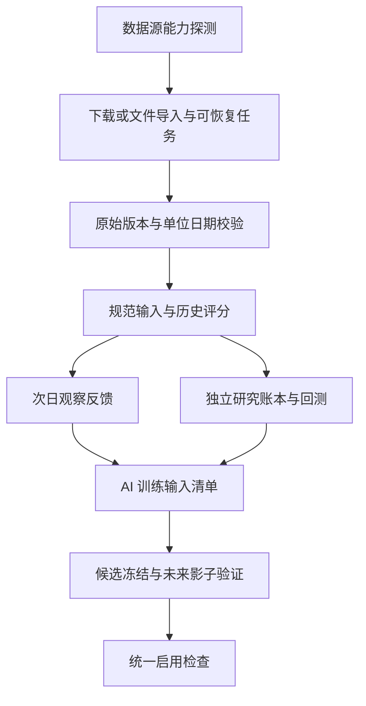

# P2：历史冷启动、评分重构与研究回测

> 状态：待实施（调研与设计）。
> 调研日期：2026-10-10，时区 Asia/Shanghai。
> 设计依据：[2967a6a](https://github.com/sanchez0623/ashare-limit-lens/commit/2967a6ab0b4f91a59b82baf0f0e884a11ada85be)。
> 文档入口：[统一索引](../README.md)。

历史冷启动应让系统安装后就能研究过去的评分、反馈与策略表现，并生成待验证候选。推荐先做数据能力探测、历史输入隔离和评分反馈，再做独立分钟回测，最后接入前瞻影子验证。免费公开数据不保证能补齐几个月的完整涨停特征；历史回测也不能替代冻结候选之后的新市场数据。

本文包含官方资料核查和现有公开接口的只读探测，没有导入生产历史记录、开通付费行情权限或执行历史交易。

## 1. 冷启动究竟解决什么

目前主账户不需要等 30 个交易日才能交易：首次盘后建立基准和事前计划，下一实际交易日起即可自动模拟。等待样本的是 AI 改进与长期评价。

当前 `improveStrategy()` 至少要求 20 个训练日和 10 个未用于候选验证的测试日，并要求相邻评分、真实行情和执行覆盖。30 日只是最小数量，不代表积累满 30 日就一定有合格验证数据。[当前提案代码](../../backend/services/improvement.js)、[当前使用说明](../paper-trading.md)。

现有收益核验能重放已经记录的模拟成交，不等于从外部数据建立跨数月历史回测。`saveSnapshot()` 刻意只保存当天盘后评分、`loadReview()` 只评价当天收盘实况；这些限制保护事前信息，不能直接删除以实现冷启动。[评分与反馈代码](../../backend/services/review.js)。

新增能力分三种交付：

| 能力               | 所需输入                                            | 可交付结果                                                           |
| ------------------ | --------------------------------------------------- | -------------------------------------------------------------------- |
| 历史评分与观察反馈 | 当天完整涨停/炸板特征、相邻交易日价格               | 当时特征重构、板块评分、次日排序反馈；观察收益不含交易可达性保证     |
| 历史策略研究回测   | 上述输入，加研究精度所需价格/量、涨跌停价与公司行为 | 独立研究账本、扣费净值、风险、成交与假设；结果标明日线/分钟/观测模型 |
| AI 历史预训练/提案 | 合格训练输入及明确的研究指标                        | 立即提出冻结候选、开展影子验证；不能把重构历史包装成已完成前瞻验证   |

如果只下载日线而没有封板特征，应交付降级的观察研究，不能承诺完整复现当前六因子策略。

## 2. 调研证据与数据源选择

### 2.1 官方资料确认的能力

| 数据源                                           | 能力                                                               | 限制与选择                                                                   |
| ------------------------------------------------ | ------------------------------------------------------------------ | ---------------------------------------------------------------------------- |
| 东方财富现有涨停池，AKShare 文档作为接口能力参考 | 封单、封板时间、炸板和连板等特征，接近现有输入                     | 官方 AKShare 文档注明只能取近期，不能保证任意数月历史                        |
| 东方财富分钟接口                                 | 近期分钟 OHLCV                                                     | AKShare 文档注明 1 分钟仅近 5 个交易日且不复权；不能用来承诺长期一分钟历史   |
| 腾讯现有日线/交易日接口                          | 已有代码可取指定区间价格和交易日                                   | 当前封装固定请求 80 条；需探测、分段、校验日期，不能直接作为无限历史下载器   |
| 腾讯现有分时接口                                 | 当前代码按返回日期提取近期分时样本                                 | 未查到稳定长期覆盖承诺；实际覆盖和解析均需探测，不能依赖它重建几个月完整盘口 |
| Tushare `limit_list_d`                           | 涨跌停和炸板数据、首末封板、封单、换手和连板，文档说明从 2020 年起 | 要 Token 与相应权限，不能作为无注册免费源；文档当前列有积分门槛              |
| Tushare `stk_mins`                               | 历史 1/5/15/30/60 分钟行情，HTTP/SDK，文档说明长历史               | 分钟权限需单独开通；一分钟不等于现有 10 秒观测流                             |
| 用户已有合法历史文件/自行归档                    | 可导入完整特征、分钟或实际观测记录                                 | 必须附字段/单位/来源清单，验证真实性、日期和精度，不能默认视为合格           |

近期接口限制依据 [AKShare 股票文档中的涨停股池与分时说明](https://akshare.akfamily.xyz/data/stock/stock.html)。长期涨停输入依据 [Tushare 涨跌停列表](https://tushare.pro/document/2?doc_id=298)，分钟能力与单独权限依据 [Tushare 历史分钟行情](https://tushare.pro/document/2?doc_id=370)。积分、费用与配额会变化，实际接入前按账户权限再验证；本方案不自动购买服务。

AKShare 作为调研参考，不要求把 Python/AKShare 加入现有 Node 常驻服务。Tushare 可直接用 HTTP 适配，已取得的 CSV/JSON/Parquet 可由离线导入器处理。

### 2.2 本次公开接口实测

使用仓库现有 `getPool()`、`minuteBars()`、`tradingCalendar()`，仅发只读行情请求，摘要如下：

| 探测                                              | 结果                                             | 对设计的影响                                                   |
| ------------------------------------------------- | ------------------------------------------------ | -------------------------------------------------------------- |
| 东方财富涨停池 `2026-10-09`                       | 日期匹配，返回 69 条                             | 当前日期请求可用，不代表过去数月可用                           |
| 东方财富 `2026-09-30`、`2026-07-01`、`2025-10-09` | 现有适配器均拒绝：来源日期与请求日期不一致       | 必须校验返回日期；不能将错误日期改名写成所请求历史             |
| 腾讯分时 `000001`、`2026-07-01`                   | 所需日期不在匹配分时数据中                       | 老日期不可据此补齐完整盘中路径                                 |
| 腾讯分时 `000001`、`2026-10-09`                   | 当前解析器报时间序列无效                         | 需专用规范化器并保留隔离理由，不能先宣称分钟输入完整           |
| 腾讯分时原始形态                                  | 本次返回各日 267 条，存在 15:06 这样的时段外记录 | 分类隔离竞价/盘后/异常记录；不可拿盘后行充当 15:00 的收盘成交  |
| 腾讯交易日 `2026-05-01..2026-09-30`               | 返回 80 条，从 2026-06-09 开始                   | 证明当前封装的 80 条限制会截掉较早日期，必须分段并核对完整日历 |

这是本次环境与当前适配器下的观测，不是供应商永久覆盖保证，也不是对原始数据真实性的独立证明。历史日期需与合格交易日历交叉核对；样本返回某日数据不等于交易所确认该日开市。

### 2.3 推荐两条路线

**默认免费路线**：优先抓取仍可获取的近期完整涨停特征，立即开始长期归档；用公开日线补价格/观察反馈。覆盖能力不足时显示缺项与能做的研究，不伪造完整评分，不把近期数据当作数月完整训练集。

**完整历史路线**：用户提供有权限的历史供应商或已有档案，首批目标最近 120 个已结束交易日，额外包含特征预热期和相邻标签所需日期；对齐涨停/炸板特征、历史名单/行业、未复权价格、涨跌停价和分钟数据。仅在能力探测通过后启动完整任务。

因此“完全免费 + 几个月完整六因子 + 完整做 T 回测”不是当前已证实的数据能力。实现优先保证真实可用与可核验，而不是用字段填零生成漂亮净值。

## 3. 输入字段、缺失与信息时点

### 3.1 当前评分所需输入

当前评分是六因子：封板质量、封单强度、换手结构、首封时点、板块协同、连板结构。[评分实现](../../shared/scoring.js)。

| 规范字段            | 当前东方财富字段 | Tushare 可对应字段               | 处理要求                                               |
| ------------------- | ---------------- | -------------------------------- | ------------------------------------------------------ |
| `code / exchange`   | `c` 与市场信息   | `ts_code`                        | 标准证券 ID，保留交易所，不仅猜前两位数字              |
| `nameAsOfDate`      | `n`              | `name`                           | 验证是否历史名称，不能用今天的 ST/退市名称过滤过去     |
| `industryAsOfDate`  | `hybk`           | `industry`                       | 保留分类体系及历史时点可信度，不假设供应商行业划分一致 |
| `price / change`    | `p / zdp`        | `close / pct_chg`                | 未复权成交价格，原始单位转换后校验                     |
| `amount / seal`     | `amount / fund`  | `amount / fd_amount`             | 统一人民币元；不能把封单金额和成交金额混为一项         |
| `turnover`          | `hs`             | `turnover_ratio`                 | 百分数与小数比例分开，不默默乘除 100                   |
| `first / last`      | `fbt / lbt`      | `first_time / last_time`         | 本地时段 HHMMSS，原始值/异常原因留档                   |
| `breaks`            | `zbc`            | `open_times`                     | 区分缺失和零次，拒绝负数                               |
| `height`            | `lbc`            | `limit_times`                    | 按实际相邻交易日，不能用自然日补连板                   |
| `broken / previous` | 炸板池、昨日池   | 对应炸板、相邻前一交易日涨停样本 | 用于封板率与晋级反馈，不能用当日结果补造前日名单       |

Tushare 所列字段来自其 [涨跌停列表官方说明](https://tushare.pro/document/2?doc_id=298)。转换到规范数据后再调用 `analyze()`，不先伪造一套东方财富原始字段以掩盖供应商差异。特别注意不同接口的市值、金额、成交量单位需按字段文档和样本核对，不能统一假设“都为万元”或“都为手”。

不同供应商行业口径会改变板块和个股评分；记录 `taxonomyId`、映射版本与覆盖程度。混合来源产生的评分不能直接声称与线上东方财富评分一致，需要分层评价和前瞻检验。

研究股票池还需事前声明交易所、板块、ST、新股等范围，并核对实际数据是否符合范围。不能因为供应商返回全市场，就把线上宣称的沪深主板/创业板范围默默拓宽；实际代码与说明若有差异，先报告并统一口径，再计算可比较的情绪、板块和策略表现。

### 3.2 两个独立质量维度

输入完整性与历史时点可信度分别记录：

```js
const sampleProvenance = {
  origin: "HISTORICAL_RECONSTRUCTED",
  provider,
  providerSchemaVersion,
  taxonomyId,
  tradeDate,
  fetchedAt, // 实际下载时间，不能改成过去
  effectiveAt, // 信息所属时点
  availabilityEstimatedAt, // 推定可用时点，不冒充采集证据
  pointInTimeConfidence, // ARCHIVED / SOURCE_REPORTED / INFERRED / UNKNOWN
  fieldCoverage,
  rawDigest,
  normalizedDigest,
};
```

字段齐全不代表供应商没有事后修订。历史名称、行业、资金字段、复权和发布时间可信度不足时，照样标注，不能仅靠一个 `complete: true` 掩盖。缺失因素维持 null；不填成 0、均值或当前值以凑覆盖。

当前交易条件要求个股指标覆盖至少 80%。只有日线时通常缺少关键封板因素，不能直接继续当前策略并称为同一个评分模型；可以另建命名明确的日线研究策略，但参数、报告和结论分开。

### 3.3 因果日期规则

历史流程为 D 日盘后特征 → 为 D+1 制定虚拟计划 → 使用 D+1 行情研究成交/收益。不能使用 D+1 涨停名单、成交量或收盘评分去筛选 D+1 的早盘买入。

保留实际 `fetchedAt/createdAt` 和研究 `virtualDecisionAt` 两套时钟。研究引擎可以按历史时间生成计划，但该记录始终标为重构研究；不能将其写入正式 `snapshots` 或声称是当年事前采集。

多日训练标签按 `labelEndDate/availableAt` 检查跨窗口泄漏。导入历史收益曲线后的参数选择都登记为开发/训练信息，不能把已经看过的日期重新划成独立新测试。

## 4. 历史执行精度分级

| 模型                       | 输入                                     | 允许结果                                             | 不允许的结论                                                        |
| -------------------------- | ---------------------------------------- | ---------------------------------------------------- | ------------------------------------------------------------------- |
| `DAILY_OBSERVATION_V1`     | 日线及可取得的评分特征                   | 次日观察收益、排序反馈和条件分析                     | 不宣称日线最高/最低之间能按有利顺序做 T；不与完整可成交策略收益混用 |
| `MINUTE_SAMPLE_V1`         | 每分钟一个采样价及有效增量成交量         | 明确采样假设的研究结果，两腿只能跨样本               | 不能把一个采样价扩充成真实 OHLC 或分钟内价格路径                    |
| `BAR_1M_V1`                | 完整一分钟 OHLCV、特征、涨跌停价等       | 明确模型假设的研究成交、扣费净值、T+1 与不同分钟的 T | 不能声称还原腾讯 10 秒观测或盘口排队                                |
| `ARCHIVED_OBSERVATIONS_V1` | 历史真实归档、时间和字段合格的观测及输入 | 复用实时引擎重放该组观测                             | 回放发生在现在，仍不是现在冻结候选后的前瞻成绩                      |

更粗分钟数据可作为单独模型扩展，默认不把 5 分钟线自动升格为一分钟或 10 秒。研究报告固定模型版本；不能从不同成交精度的区间挑最好收益拼接。

当前腾讯 `minuteBars()` 输出的是 `time/priceCents/volumeShares`，不是完整 OHLCV。它只能进入单独的采样模型；`BAR_1M_V1` 必须确实取得 OHLCV，不能把同一个价格填入四列冒充一分钟 K 线。

### 4.1 分钟模型建议采用保守、可解释规则

1. 先把供应商时间标签规范成 `barStart/barEnd`，确认 OHLCV 单位和时间顺序；隔离竞价、午休、盘后和非交易日记录，记录原因。
2. 仅在一根 bar 完成之后使用其收盘价形成新的触发意图；新意图最早在后一根完成的 bar 按其收盘价加滑点模拟成交。单根 bar 高低同时越线不能决定有利先后。
3. 事前计划、已触发保护退出或上一分钟产生的意图可以等待执行；不能根据后一根 bar 的走势回头决定是否产生上一根意图。
4. 成交仍检查事前价格上限、100 股买入、现金、T+1、涨跌停和费用；参与量以该完整 bar 的成交量为近似上限，同代码订单共享额度。该量价匹配是研究假设，不能宣称可在真实市场最后瞬间获得相同成交。
5. 正向/反向 T 的两腿必须出现在不同且按因果顺序处理的 bar；不能拿同一分钟 low 买、high 卖。
6. 不突破当前交易窗口：09:35 后不补普通买单，14:45 后不开第一腿，14:50 起恢复，14:57 后不继续模拟连续竞价。
7. 缺关键股票或时间段时报告不完整/无效，不能降级成“当天开盘一定成交”后继续宣称原精度收益。

沿用当前一百万默认资金和可配置六项费用，复用 `executeFill()` 的整数分、FIFO 和成本核算；各研究组合冻结费用版本。[交易与财务领域函数](../../backend/domain/trading.js)。

必须新建明确的 `BAR_1M_V1` 适配器，不能将分钟 OHLC 复制成多个虚构 10 秒报价后传入实时引擎。当前旧版 `executePlan()` 包含不同执行假设，只用于旧模型兼容，不能不留版本地当作新分钟引擎。

### 4.2 除权、停牌、涨跌停和历史名单

- 成交与估值使用未复权价格。复权价适合某些研究特征，不能直接代入资金账本；今天生成的前复权序列还需留修订版本。
- 优先使用真实历史涨跌停价，而不是所有股票按昨日收盘 ±10%。Tushare 提供专门的每日涨跌停价格输入。[`stk_limit` 文档](https://tushare.pro/document/2?doc_id=183)。
- 证券名单含当时上市和后来退市股票，不只取今天仍上市的股票，避免幸存者偏差；上市日、历史 ST、无涨跌停期和停牌需要时间区间数据。
- 公司行为需有明确账本事件：现金分红、股数/成本调整及税费等按已支持模型处理。未支持配股、公司行为资料不足或价格不一致时停止并标记研究不完整，不能把价差当亏损/收益，也不能事后删除发生除权的股票让曲线好看。
- 研究起点与结尾持仓必须保留；末期按合格收盘价盯市，不为了凑完整交易次数假设强制平仓。

## 5. 导入架构与存储隔离



### 5.1 不污染主账户

历史数据不写正式 `snapshots/reviews/paper_market_days/paper_ledger/paper_equity`。主账户默认一百万基准、既有持仓和持续收益不改变，不能把过去虚拟盈利加进今天现金。

历史下载、规范化、评分和回测运行在独立子进程。大数据保存在本机研究专用 SQLite 与分日归档文件，避免当前同步 SQLite 适配器的大任务阻塞 10 秒交易；轻量研究血缘、次数与样本使用仍遵守同一个全局研究空间，不能通过独立数据库或账户别名重置防过拟合规则。

网站 D1 与本机研究空间独立，显示账户/数据空间标识。首期以 Windows 常驻实例为历史研究权威；如将来需要网站查看同一研究，另加明确的只读同步接口，不直接上传数据库或复用私密会话。

### 5.2 数据源接口

```js
const provider = {
  capabilities: async (requestedRange) => {},
  tradingCalendar: async ({ start, end }) => {},
  historicalUniverse: async ({ date }) => {},
  limitFeatures: async ({ date }) => {},
  dailyPrices: async ({ codes, start, end, adjustment }) => {},
  priceLimits: async ({ codes, start, end }) => {},
  bars: async ({ codes, start, end, frequency }) => {},
  corporateActions: async ({ codes, start, end }) => {},
};
```

`capabilities()` 返回已证实日期范围、字段、频率、单位、权限状态和探测时间。缺权限与没有数据分别报告；空表不能自动代表“当天没有涨停”。供应商端点固定白名单，Token 仅在服务端；不提供任意 URL 请求接口。

当前腾讯 80 条日线封装需改为历史专用分段适配器，不能改变在线短窗口语义后影响原交易日确认。每段验证最早/最晚日期和完整交易日集合，重叠段用于一致性核对，并对返回顺序、重复行和截断做显式处理。

### 5.3 任务状态和断点续传

```text
PLANNED -> PROBING -> DOWNLOADING -> NORMALIZING -> SCORING -> READY
           缺权限/缺字段/缺日期 -> PARTIAL / BLOCKED
           处理错误           -> FAILED，可从持久化断点恢复
```

首批建议请求最近 120 个已完成交易日，加预热与相邻标签所需日。股票池在各历史日期确定，包含当时所有合格候选及研究组合持仓；不能只下载最终赚钱股票，也不能只下载当前主账户股票。

每个下载块记录供应商、接口、范围、实际日期、行数、原始摘要和解析版本。下载失败只重试缺块，有退避、权限识别、供应商流控与取消能力；缓存命中也校验摘要。先在 staging 中验证，整份 manifest 就绪后原子发布该研究数据集版本。

同一日期供应商修订数据时新增版本，不覆盖旧报告引用的原始数据。研究结果固定输入 manifest。下载到部分数据可以展示，但不会把任务标为完整 `READY`；回测与 AI 训练根据各自能力要求决定是否可用。

### 5.4 建议表

| 表                         | 关键字段与约束                                                                                  | 作用                                    |
| -------------------------- | ----------------------------------------------------------------------------------------------- | --------------------------------------- |
| `history_import_jobs`      | `id PK, namespace, requested_range, provider, stage, progress, lease, manifest_ref, created_at` | 能力探测、断点和任务状态                |
| `history_chunks`           | `(job_id, chunk_key) PK, request_range, actual_range, rows, stage, raw_digest, artifact_ref`    | 分块下载，支持幂等恢复                  |
| `history_dataset_versions` | `id PK, provider_schema, taxonomy_id, coverage, provenance, manifest, digest`                   | 不可变研究输入版本                      |
| `history_daily_inputs`     | `(dataset_id, trade_date) PK, payload, digest`                                                  | 日期一致的涨停/炸板、日线与辅助资料索引 |
| `history_scores`           | `(dataset_id, trade_date, scoring_version, params_digest) PK, payload, digest`                  | 历史评分；字段完整性与时点可信度分开    |
| `history_reviews`          | `(dataset_id, signal_date, label_end_date, review_version) PK, payload, digest`                 | 观察收益、排序反馈与标签可用时间        |
| `backtest_runs`            | `id PK, dataset_id, model, strategy_manifest, fee_manifest, initial_book, status, digest`       | 冻结输入、参数与执行模型                |
| `backtest_plans`           | `(run_id, signal_date) PK, virtual_decision_at, actual_created_at, payload, digest`             | 虚拟计划与真实生成时间                  |
| `backtest_ledger`          | `(run_id, id) PK, trade_date, payload`                                                          | 每笔研究成交和公司行为                  |
| `backtest_equity`          | `(run_id, trade_date) PK, payload, digest`                                                      | 可重放的每日研究净值                    |

分钟/实际观测分日压缩归档，数据库存行数、时间边界和摘要索引，避免一个巨大 JSON 或把全部行情提交到 GitHub。读取归档按白名单目录与摘要，不能由 API 任意指定服务器文件路径。

## 6. 模块和研究流程

```text
backend/domain/
  historical-input.js       字段单位、日期、质量与信息时点
  historical-scoring.js     规范输入调用原评分，构建可追溯研究快照
  historical-execution.js   BAR_1M_V1，复用现有财务纯函数
  backtest-metrics.js       研究权益、成本、回撤与交易轮次
backend/services/
  history.js                探测、下载、规范化、评分任务编排
  historical-providers.js   固定供应商适配与权限识别
  backtest.js               独立研究账本、计划、回放和报告
backend/storage/
  history.js                研究专用数据源、版本、块与归档索引
  backtest.js               计划、成交、净值和检查点
scripts/
  history-import.mjs        离线导入或拉取，子进程运行
  history-runner.mjs        限制并发与资源的研究任务调度
  verify-backtest.mjs       固定输入与执行版本离线重放
frontend/
  history.js                数据覆盖与导入进度
  backtest.js               独立研究结果，不混入主账户收益
test/
  history.test.mjs
  backtest.test.mjs
```

核心函数：

```js
probeHistoricalCapabilities({ provider, range });
normalizeHistoricalSample({ raw, providerSchema, calendar, provenance });
buildHistoricalSnapshot({ normalized, scoringParams, scoringVersion });
buildHistoricalReview({ snapshot, nextDayInput, labelAvailability });
createResearchPlan({ snapshot, book, strategy, virtualClock });
advanceHistoricalBar({ book, session, completedBar, model });
replayHistoricalStrategy({ manifest, initialBook, strategy, feeConfig, model });
verifyBacktest({ bundle, supportedExecutionVersions });
```

单次固定参数回测：双方从相同一百万/自定义资金和费用出发，按完整时间序列执行，不能每 10 日把亏损重置。滚动历史研究则每个候选只读取其训练期之前可用信息，在后续段使用冻结参数；组合账本和固定基线持续运行，输出整个路径及所有尝试，不能拼接每段最佳策略。

对于已使用的历史测试段，研究报告可用于开发分析，但不得重新声明为可启用候选的独立测试证据。历史段的选择、模型和费用都进入 manifest。

## 7. 接入 AI 时避免破坏防过拟合规则

### 7.1 一般提案

完整历史数据可立即作为训练材料，提案接口只收到训练清单与研究模型表现，并明确 `origin/model/coverage/pointInTimeConfidence`。不把未见测试数据、前瞻结果、未来日期或完整数据源自动放进大模型上下文。

不能向现有 `paper_market_days` 塞历史，然后调用当前 `improveStrategy()`：当前代码历史通过后可以直接自动启用，会绕过 [前瞻验证方案](ai-strategy-walk-forward.md)。接入历史提案之前必须完成统一启用闸门，确保所有路径都要求合格前瞻报告。

### 7.2 一次性初始化提案路径

之前研究方案对未知旧历史设置保守截止线，因此旧日期不能仅因新导入就变成“未见历史测试”。若坚持普通滚动流程，还要等待新的历史测试段。

为真正减少首次提案等待，建议在已有研究方案上**明确增加仅一次的初始化提案类型**，而不是悄悄放开日期规则：

```text
BOOTSTRAP 初始化：历史开发/训练 -> 冻结一个候选 -> 未来完整影子验证
ROLLING 常规更新：训练 -> 新历史测试 -> 冻结前瞻起点 -> 未来完整影子验证
```

- 增加 `experiment.kind = BOOTSTRAP | ROLLING`，规则版本在提案前登记。
- 初始化历史筛查标为 `DEVELOPMENT_SCREEN`，不能标成真正未见的历史验证；该数据全部登记为开发/训练/选择曝光。
- `BOOTSTRAP` 每个全局研究空间最多一次，并占用正常月度次数和统计尝试序号；新账户别名、模型变化或重装不能重置。若全局历史不完整，标明未知，不能声称过去从未尝试。
- 初始化候选可以直接进入未来影子阶段，原因是最终启用仍依赖完整的新前瞻样本，历史只用于产生合理候选。
- 未来窗口必须在冻结候选后真实到来，固定长度、不提前结束、不复用日期；匹配组合、费用、风险、完整交易轮次和累计统计误差预算全部沿用前瞻设计。
- 初始化失败后不在同一个历史段无限试新参数；按常规新实验规则和次数预算继续。
- 该路径只跳过“等待新历史筛查数据”的首次门槛，不跳过前瞻验证，不跳过参数白名单或启用一致性检查。

这是一项明确的补充政策，需要与原研究状态机一起实现；不能只新增一个直通 `activate()` 的按钮。若不采用这项补充，历史研究与训练也可以立即运行，但候选启用按原完整滚动流程等待新数据。

### 7.3 可以省掉和不能省掉的等待

能省掉：等系统自己积累数月历史训练、第一次看到过去研究报告、第一次生成候选的等待。

不能诚实省掉：候选冻结后的真实前瞻验证时间，也不能把现有一分钟数据声称为历史 10 秒真实采样。前瞻所需交易天数与证据门槛不因冷启动降低。

## 8. 接口、界面与核验

| 接口                                           | 内容                                                              |
| ---------------------------------------------- | ----------------------------------------------------------------- |
| `GET /api/history/capabilities`                | 已验证的数据范围、字段、频率、权限和最新探测结果                  |
| `POST /api/history/imports`                    | 用预定义供应商和范围建任务；已有文件以服务端批准 artifact ID 引用 |
| `GET /api/history/imports/:id`                 | 下载、缺项、块、解析和评分进度                                    |
| `GET /api/history/datasets/:id`                | 数据清单、日期覆盖、来源与质量                                    |
| `GET /api/history/scores?dataset=...&date=...` | 历史重构评分与原始证据摘要                                        |
| `POST /api/backtests`                          | 在明确模型、费用、策略下创建独立任务                              |
| `GET /api/backtests/:id`                       | 独立净值、成交、风险、覆盖与执行假设                              |
| `GET /api/backtests/:id/export`                | 固定输入与账本的可核对包                                          |
| `POST /api/research/propose`                   | 经统一研究入口引用合格训练清单，不直接启用                        |

当前本机 HTTP 服务请求体上限 12KB，不能直接塞大型行情文件。首期通过离线导入器放入指定研究目录，API 只引用已登记文件/任务；如以后增加上传接口，需要单独设计大小、格式、权限和存储边界。

页面把“实时模拟账户”“历史观察研究”“分钟策略回测”明确分开；每份报告展示数据覆盖、来源、重构/归档属性、执行精度和费用。零成交可能由策略条件造成，也可能由数据不足造成，必须分别说明。

结果 DTO 明确包含 `returnKind = OBSERVATION_GROSS | STRATEGY_NET` 和 `executionModel`，避免将未扣费观察收益显示成可执行策略净收益。写接口沿用所有者认证、同源保护和输入白名单；数据源 Token 不进入清单、导出、错误详情或前端。

收益核验包包含原始版本索引/摘要、规范化输入、虚拟时钟、评分版本、策略参数、费用、计划、逐笔成交、公司行为、每日权益与检查点。离线脚本按原版本重放，不支持的执行版本明确失败。哈希证明包内一致性，不证明供应商从未修订历史或交易真实可达。

## 9. 验收测试与实施顺序

| 验证内容       | 必须满足                                                                          |
| -------------- | --------------------------------------------------------------------------------- |
| 能力探测       | 旧日期被返回成新日期、空数据、权限不足、分页截断能区分，不能误标完整              |
| 数据规范化     | 股/手、元/千元/万元、时间标签、盘后记录、重复/倒序/缺失正确处理，原始记录可追溯   |
| 历史名单与时点 | 不用当前名单/行业/名称过滤过去；无法确认时明确质量等级                            |
| 日线降级       | 缺封板特征不生成伪完整六因子，不从日线 high/low 推导有利做 T 顺序                 |
| 分钟因果顺序   | bar 完成后才用数据；触发后至少后一完成 bar 成交，两腿不在同 bar，买入窗口到时失效 |
| 成交与财务     | 建仓、加仓、减仓、清仓、正反 T、T+1、部分成交、费用和整数分核算可重放             |
| 公司行为与缺价 | 不把除权当普通收益，不事后剔除风险股票；缺关键数据时报告不完整                    |
| 导入幂等       | 中途断网/停止、恢复、源数据修订和块重复不污染旧版本或重复写成交                   |
| 主账户隔离     | 导入不改主账户现金/计划/历史，研究任务不拖慢 10 秒循环                            |
| AI 隔离        | 只有训练数据进入提案；历史筛查不能直接启用；初始化路径至多一次并占预算            |
| 前瞻联动       | 导入历史不算前瞻日期；失败/不足不降低门槛，人工入口也不能绕过                     |
| 核验与权限     | 篡改数据/费用/计划能被发现；Token、个人导出和数据库不进入前端或 Git               |

推荐实施批次：

1. **数据能力与隔离**：供应商适配、探测、专用研究库、任务断点、来源与质量；先验证确实能取得需要的数据。
2. **历史评分和反馈**：复用六因子与排序反馈，完成真实历史输入下的重构；缺失明确展示。
3. **研究成交与核验**：实现版本化分钟模型和独立账本，验证多轮交易、费用、异常与导出。
4. **AI 冷启动联动**：统一启用闸门完成后接入合格训练清单和一次性初始化类型，启动匹配影子组合。

测试用确定性合成输入验证流程，并用一个经权限和覆盖确认的真实历史小区间做数据集成验证；没有数据权限时不能声称真实长历史验证完成。真实前瞻验证仍按交易日自然推进。

[主动告警方案](operations-alerting.md) 应先落地：历史下载与回测量大，要能及时发现任务停滞、存储压力和对交易进度的影响。两个设计都保持服务端执行、前端展示和秘密不出服务端的边界。
