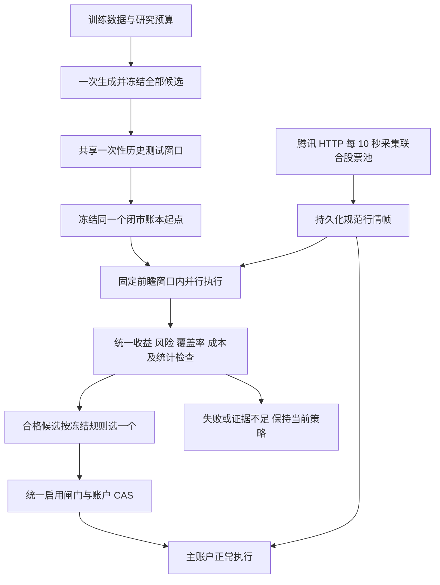

# P2：多策略并行模拟、赛马评估与受控晋级

> 状态：待实施（调研与设计）。
> 调研日期：2026-10-10，时区 Asia/Shanghai。
> 主分支依据：[d18cf08](https://github.com/sanchez0623/ashare-limit-lens/commit/d18cf086b07a4c2d036cab1964478a60d8b3e843)。
> 研究分支参考：[642820d](https://github.com/sanchez0623/ashare-limit-lens/commit/642820d039687496babff7ba0e4eb9c4897e72f7)，已新增针对上次审查的修复，尚未合并到主分支；相关修复需重新验收。
> 文档入口：[统一索引](../README.md)。

推荐实现一个候选数量受限的策略赛马系统：同一份腾讯实时行情驱动多个独立纸面账本，在相同起点、费用、成交规则和固定前瞻窗口内比较。主账户持续交易；赛马结束后，系统只从满足全部验证条件的候选中选择一个，用于主账户以后尚未冻结的计划。

首期建议 4 个候选，共享两个匹配对照，保持一个活动研究窗口。既有资金默认 100 万元、六项可配置费用、10 秒轮询、T+1、仓位与回撤硬风控继续适用。赛马增加研究广度，不代表把多个独立账本的收益相加，也不能仅凭排行榜第一就自动替换主策略。

本文交付设计、公开资料核查和纯交易内核的合成探测，不表示多账户执行、策略晋级或完整赛马回测已经实现。

## 1. 现状与真正的扩展点

| 代码位置                                                     | 核查结果                                                                                   | 扩展方式                                                  |
| ------------------------------------------------------------ | ------------------------------------------------------------------------------------------ | --------------------------------------------------------- |
| [`trading.js`](../../backend/domain/trading.js)              | `maxPositions = 4` 是默认值；评分权重、开仓阈值、持仓天数、止损止盈和 T 参数由策略对象传入 | 为每个组合传入冻结的独立策略对象，不复制交易规则          |
| [`validation.js`](../../backend/domain/validation.js)        | 当前 AI 参数范围已允许持仓数量 2～5；仍有固定的加仓、减仓和情绪门槛                        | 首期赛马现有参数；新增门槛或策略家族另立执行/参数版本     |
| [`realtime.js`](../../backend/domain/realtime.js)            | `openSession/advanceSession/closeSession` 为可复用的账本状态转换；成交 ID 未包含账户       | 保持纯函数，增加账户作用域的存储键和消费游标              |
| [`storage/realtime.js`](../../backend/storage/realtime.js)   | SQL 绑定 `primary`，会话和观察按交易日保存                                                 | 主账户保留兼容适配器；影子账户使用显式 `accountId` 的仓库 |
| [`services/realtime.js`](../../backend/services/realtime.js) | 报价来自主账户订单和持仓，且受主账户是否可执行影响                                         | 报价采集独立运行，覆盖所有研究组合，不受单个账户阻塞影响  |
| [`trading-runner.mjs`](../../scripts/trading-runner.mjs)     | 单 Windows 常驻循环顺序执行盘中与盘后任务                                                  | 复用单调度器；统计、历史研究和 AI 请求放到独立任务进程    |

因此“固定最多 4 只”需要更正为“当前默认 4 只且只运行一个主策略”。多组参数仍须逐账户遵守单股 20%、总仓位 60%、最大回撤 10% 等硬限制。把持仓数量改为 5 不允许放松这些限制。

## 2. 技术与统计调研结论

| 路线                             | 适用性                                                 | 本项目选择                                 |
| -------------------------------- | ------------------------------------------------------ | ------------------------------------------ |
| 固定候选同时前瞻运行，结束后选优 | 可匹配行情、起点和窗口；易于审计和重放                 | 首期采用，限制候选数量并冻结规则           |
| 大网格回测，取历史收益最高的一组 | 搜索越多越容易选中噪声，需要完整搜索日志和额外检验     | 用于隔离的训练研究；不直接决定主账户启用   |
| 每天将资金转给最近收益第一的策略 | 排名波动、策略切换、交易成本和持仓承接会改变实际收益   | 后续作为单独的“策略选择器”研究，首期不采用 |
| 多策略实时分配主账户资金         | 可改善组合分散，但需要统一现金、风险、成交量和费用分配 | 后续能力，不能拼接独立模拟净值代替真实组合 |

White 的 Reality Check 讨论重复使用数据进行模型选择的偏差，以及对多个模型比较进行 bootstrap 检验。这支持“登记完整候选集合、对多次比较做处理”的设计；它不证明任意收益排序都有效。[原始论文](https://users.ssc.wisc.edu/~behansen/718/White2000.pdf)。

Bailey 等人的 PBO/CSCV 研究说明，样本内选出的最好配置可能在样本外失去优势。历史诊断可借鉴其方法，但 CSCV 不是本项目因果前瞻执行的替代方案。[作者公开论文](https://www.davidhbailey.com/dhbpapers/backtest-prob.pdf)。

SQLite 官方说明 WAL 支持读写并行，但仍只有一个写入者，且不适用于跨机器网络文件系统。Windows 首期应采用本地数据库、短事务和统一写队列；不用“每套策略启动一个进程并抢写同一个账本”的方式。[SQLite WAL 文档](https://www.sqlite.org/wal.html)。

### 2.1 本次合成内核探测

使用现有纯函数模拟 8 个账本消费同样的两个合成股票、1,423 个 10 秒观察帧，并调用盘后结算。8 个账本对应主账户、4 个候选、2 个匹配对照及持续固定基线。

| 项目                             | 本次结果                                      |
| -------------------------------- | --------------------------------------------- |
| 环境                             | 云环境 Node v24.19.0；内存模拟                |
| 状态推进次数                     | 11,384 次                                     |
| 全部推进及结算耗时               | 两次探测约 673～878 毫秒                      |
| 每帧推进 8 个账本耗时            | 平均 0.467～0.610 毫秒，P95 0.726～0.913 毫秒 |
| 合成成交记录                     | 116 条                                        |
| 未增加账户作用域时的成交 ID 重复 | 96 次                                         |

该实验确认内核复用与 ID 隔离需求。它不包含 HTTP、SQLite 持久化、全涨停研究池、非空期初账本或 Windows 实机负载，不能据此承诺完整系统的吞吐和收益。可复现脚本见 [benchmark-strategy-kernel.mjs](experiments/benchmark-strategy-kernel.mjs)。

## 3. 首期运行方式与配置



| 参数                      | 建议初值                       | 约束                                                       |
| ------------------------- | ------------------------------ | ---------------------------------------------------------- |
| `mode`                    | `TOURNAMENT`                   | 通过新的政策版本开启；原单候选模式保留                     |
| `maxCandidates`           | 4                              | 初版所有者可设 2～4，不做参数笛卡尔积                      |
| `monthlyGenerationLimit`  | 1                              | AI 和人工模板共用生成批次预算                              |
| `maxActiveCohorts`        | 1                              | 与单候选验证共用全局活动窗口锁                             |
| `trainingDays`            | 60                             | 延续 60～120 日训练范围                                    |
| `historicalTestDays`      | 20                             | 延续 20～60 日一次性历史测试范围                           |
| `forwardDays`             | 60                             | 建议赛马使用 60 日；可事前设 30/60/90，不能中途延长        |
| `minimumCompletedRounds`  | 10                             | 候选及匹配父策略各自满足；固定基线允许按规则空仓           |
| `pollIntervalSeconds`     | 10                             | 继续走腾讯 HTTP 短连接轮询                                 |
| `rankingRule`             | 先通过全部闸门，再按净收益排序 | 同收益按较低回撤、较低费用、较小参数变化、固定 ID 顺序决胜 |
| `promotionLimitPerCohort` | 1                              | 一批最多启用一个候选                                       |

60 日是本次赛马模式的建议新政策，不回写已有单候选的 30 日设计。60 个交易日通常需要约 12 周，短期活跃度不足仍可能无法晋级。系统通过同时研究少量候选提高广度，不声称能缩短真实前瞻等待。

仅允许所有者在无活动研究窗口时保存新政策。AI 不能修改候选数量、比较方式、统计预算、费用、初始资金或风控。运行实例配置和政策的修改均留版本。

## 4. 策略空间如何扩展

### 4.1 第一阶段：现有参数的四个明确方向

下面是相对当前默认参数的示例；实际使用相对当期父策略的合法变化，且仍执行每个候选最多 2 个参数组及步长限制。

| 候选                  | 示例 patch                                     | 假设                                     |
| --------------------- | ---------------------------------------------- | ---------------------------------------- |
| A：提高筛选要求       | `minScore: 82, maxPositions: 3`                | 更少、更高分的开仓是否优于当前默认       |
| B：增加分散           | `minScore: 78, maxPositions: 5`                | 适度放宽筛选并分散是否提高扣费表现       |
| C：缩短观察与收紧止损 | `maxHoldDays: 4, stopLoss: 0.055`              | 更快退出是否减少回撤及资金占用           |
| D：评分与 T 触发微调  | 权重第一项 +2、最后一项 -2；`tSellRise: 0.025` | 有限评分调整及卖出触发变化是否有收益贡献 |

示例不是收益建议，也不是永久固定的四组最优参数。权重仍须 6 个整数、总和不变、最多改 2 项且每项不超过 2。参数触及边界时，生成器应在测试前确认合法；产生无变化、重复或不合法参数时登记相应失败，不能看过测试收益后补一个替代候选。

训练阶段可计算候选选股重合度、信号频率和收益相关性。近乎相同的候选不值得消耗多套影子资源；去重依据和规则在看测试结果前固定，所有实际用于选优的研究尝试仍登记。

### 4.2 第二阶段：不同策略家族

首板、连板、板块共振、较低换手等家族先实现为白名单内的确定性选股函数，再沿用同一个规划和财务引擎。参数清单增加 `familyId/familyVersion`，在训练集评估后与普通候选一起冻结。

现有硬编码的加仓评分 88、减仓评分 65、情绪分档等，可在下一执行版本中变为有范围和步长约束的策略字段。关闭做 T、改变仓位分配函数、引入新的入场规则等属于离散策略变化，必须制定对应策略空间政策，不能冒充现有小幅数字 patch。

各家族只能读取信号日当时可获得的数据；行业归属、连板高度和市场情绪均随快照冻结。模型输出 `familyId` 与合法参数，服务端查注册表执行，禁止 `eval` 或加载模型生成的任意代码。

### 4.3 第三阶段：情绪适配与组合分配

可以研究一个冻结的选择器，例如用上一交易日情绪选择已登记的策略家族。它自身就是新的策略候选：有父版本、参数和未来窗口，需验证切换费用、持仓承接与真实路径。不能事后把上涨阶段的 A、下跌阶段的 B 拼成净值再声称可以交易。

如果以后用 50%/30%/20% 分配主账户资金，资金总额仍是原账户权益，所有子组合共享总体现金、单股风险和总仓位限制。同一股票的成交量参与率需合并检查，正反向需求要经过统一执行协调并分配费用；不能让每个子组合各享有 100 万资金和完整成交量额度。首期独立影子赛马不承担这类真实组合分配。

## 5. 与一次性测试及全局研究预算衔接

本功能对 [AI 前瞻验证方案](ai-strategy-walk-forward.md) 的单候选假设作显式扩展，必须使用新政策，不能绕过已有活动槽。

### 5.1 共同冻结的候选批次

一个 `cohort` 是一个事前登记的验证批次，包含最多 4 个候选成员和共同对照。先预留固定成员槽位，再一次调用模型或生成模板；所有合法候选的参数、输出及成员清单必须在任何成员进行历史测试收益计算前持久化。

不允许 A 测完后根据结果生成 B；不允许窗口中途加入候选、修改参数、删除亏损成员或只展示赢者。AI 只收到训练窗口。日常解释性评分可以展示，但不能覆盖代码闸门；若解释报告被用于后续参数选择，涉及日期必须登记 `SELECTION/TRAIN` 使用。

首期一批预留 N 个候选尝试序号，即全局 `attemptSequence += N`，每个槽位对应一个不可重用的 `k`。失败、模型错误、非法 patch、无变化和重复候选占用已经预留的序号及生成批次预算，未使用的槽位也留痕；不把失败重试包装成另一个免费候选。

系统实际用于参数选优的人工配置、训练网格和历史研究也记录尝试及样本用途。重复核验同一个冻结报告可幂等运行，不产生新的选优机会。旧流程未记录的搜索次数明确未知，不声称统计预算覆盖全部过去研究。

### 5.2 同一批允许共享测试日期，但不能再次开启批次复用

测试日期全局键仍为 `(namespace, outcomeDate)`，占用者扩展为 `ownerType/ownerId`：单候选属于一个实验，赛马属于一个冻结 cohort。

- 同一 cohort 的事前冻结成员及共同对照允许消费该 cohort 已占用的历史/前瞻日期。
- 新 cohort 的测试日期不得与历史任何 `TRAIN/HISTORICAL_TEST/FORWARD_TEST/SELECTION` 日期重叠。
- 旧测试允许以后用于训练；换参数、账户名、模型、费用或政策不会恢复测试资格。
- 允许共享的是事前确定的一次联合比较，不是后来取得读权限的候选。

每个成员仍单独写 `research_sample_uses`，指向共同的样本 manifest 和日期所有者。原子预留内部重新检查全部历史用途、截止线、活动窗口、预算、政策及账户环境，不能只依赖事务外的预检查。

### 5.3 一次比较越多候选，统计预算越紧

首版沿用全历史序号分配，候选与父策略、匹配固定基线各做一次比较：

```text
alpha_k = 0.05 / [k × (k + 1)]
alphaPerComparison_k = alpha_k / 2
B_cohort = max(10000, ceil(50 / min(alphaPerComparison_k)))
```

所有成员使用同一按日期重采样的索引，保留它们之间的相关性；初版使用固定种子的循环区块 bootstrap，区块长度 5 日。统计验证由专门模块计算配对每日对数收益差的单侧下界，不能把股票、成交或 T 的两腿当作独立市场日样本。

如果此前没有可审计新尝试，第一批 `k = 1..4` 对应整批至少 40,000 次重采样。模型一次输出四组参数，不能按一次统计尝试处理。最终从合格集合选择任意成员，仍须由各成员事先分配的检验预算覆盖；所有检验近似有效是误差控制的前提，短样本、非平稳市场下不能声称严格保证永不过拟合。

原方案有 100 万次重采样上限，按该公式 `k >= 22` 就会超限。开启赛马前应预检本批所需计算预算；不足时返回 `COMPUTE_BUDGET_INSUFFICIENT` 并保持当前策略，不进行无意义的模型调用。以后提高计算额度或引入校准过的更高效检验，必须事前保存新统计政策，并保留全历史序号和已支出的误差预算，不能重置计数重新获得 5%。

Reality Check/SPA 等联合比较方法可以作为后续统计版本研究；“整体至少一个策略优于基线”的结论不能直接充当任意具体冠军的启用资格。不能看本次结果后临时更换检验方法。

## 6. 账本、公平比较与完整交易过程

历史筛查期初状态从当时可重放的账本前缀恢复，或在训练段由父策略预热；不能使用后来主账户的持仓回填过去。历史阶段所有候选及共同对照复制同一个历史起点。合格历史报价缺失时，不能按日线补造实时成交。

历史筛查完成后，在同一个已结算、没有进行中盘中会话的闭市时点，原子捕获主账户 revision 和完整账本，创建：

1. N 个候选匹配组合。
2. 一个冻结父策略匹配组合。
3. 一个冻结 `baseline-v1` 匹配组合。

六个匹配组合在 N=4 时共享同一个期初权益、现金和持仓状态。复制内容包含 FIFO 批次、买入日期、成本、累计费用、未实现盈亏、历史风险峰值，以及未完成减仓、清仓和 T 的补腿。每个组合再根据自身策略冻结下一实际交易日计划。

另保留主账户和一个自升级起点连续运行的固定基线，所以完整首期最多有 8 个活动账本。连续基线观察长期自适应策略的整体路径；它不冒充实验内的匹配对照。

独立影子组合是假设路径，各自在自身账本内遵守参与率和资金约束，不互相争夺模拟成交量。建仓、加仓、减仓、清仓、正反 T 的补腿均交给同一版本的纯交易引擎，不为赛马写一份简化成交规则。

费用使用共同冻结的六项配置与版本，默认沿用佣金率 0.00005、最低 5 元、卖出印花税 0.0005、经手费 0.0000341、证管费 0.00002、过户费 0.00001。当前资金默认 100 万元；非空主账户期初权益可能已经变化，应使用实际闭市权益作比较分母，不能给候选充值回 100 万。

期初尚未完成的 T 补腿继承其已冻结约束；新策略只影响以后新计划和新增意图，不能利用改阈值重写旧第一腿。该边界对候选开户、冠军启用和策略回退都一致。

## 7. 行情与执行架构

### 7.1 一次联合采集，多账本独立消费

行情订阅股票为：主账户、所有匹配组合及持续基线的持仓、未完成保护/补腿订单、冻结计划之并集。为了积累可检验候选的历史，另采集上一交易日冻结涨停样本全集，或事前声明的较小研究池。持仓不再涨停时仍持续采集。

`tradingQuotes()` 继续使用腾讯 HTTP 短连接；按探测出的批次能力和截止时间拆请求，不为每个策略单独重复请求。HTTP 分批不是原子快照，每批记录抓取时间、来源时间、缺失代码及错误状态；每只股票仍按自身时间检查新鲜度。盘口数据不足时不承诺真实排队成交。

当前封装每批最多 150 个代码且共用 12 秒请求超时，扩展研究池时不能直接承诺满足 10 秒周期。新的采集器建议最多 2 个请求并行、整轮行情预算 6 秒，优先安排主账户持仓和保护订单的必需代码；超时写入缺失状态而非等待无限重试。批次大小及预算均须在 Windows 网络上探测，150 是当前实现值，不是腾讯服务的永久承诺。

规范化行情先持久化为不可变帧，再被组合消费。账户消费相同帧的自身股票子集，不允许某个组合因处理慢而从未来帧取价。报价采集不能依赖主账户“未熔断、未结算、计划就绪”等执行条件。

帧标识使用 `tradeDate/sequence`，引用实际采集时间、股票池 manifest、执行允许时段和来源解析版本。首期保留旧主账户 `paper_live_ticks` 兼容记录，但引用同一帧摘要，避免存在两条不同的主账户行情来源。

### 7.2 调度与幂等恢复

```js
async function consumeFrame(accountId, frameKey) {
  const checkpoint = await accounts.loadCheckpoint(accountId);
  if (checkpoint.hasConsumed(frameKey)) return;
  const frame = await quotes.loadPersistedFrame(frameKey);
  const next = engine.advanceSession(
    checkpoint.book,
    checkpoint.session,
    frame.observation,
  );
  await accounts.commitWithCas({
    accountId,
    expectedRevision: checkpoint.revision,
    expectedCursor: checkpoint.cursor,
    frameKey,
    next,
  });
}
```

实际实现还必须检验帧次序、计划日期和执行版本。账户状态、会话、成交、事件及消费游标通过一个 CAS/nonce 守卫原子提交。每个账户按序消费，一只账户的重试不重复主账户成交；同一时间的各账户结果不要求一次跨账户大事务完成。

物理存储键采用 `(accountId, localTradeId)`、`(accountId, tradeDate)` 等组合键。保留引擎产生的局部 ID，主账户已有 ID 和财务验证继续兼容，不能把重名成交插入同一个无账户作用域的表。

崩溃后只消费已经落盘的帧。断线后没有保存的 10 秒行情不能补造，不将累计成交量当作断线期间可成交量。框架允许处理延迟造成的持久化帧积压；“尚未采集的缺失”与“已采集但尚未处理”分开计量。

调度器优先主账户风险与订单处理，再推进其他账本；单影子故障记录独立健康状态。共同存储无法写入时停止新增模拟成交并告警，不能使用未持久化输入继续记账。严重研究负载导致轮询延迟时，本批证据不足，不临时删除表现差的候选来恢复成绩。

### 7.3 Windows 首期资源安排

- 一个行情/交易调度进程、一个受限研究任务进程；SQLite 状态写入由短事务和统一写队列协调。
- AI 网络请求、历史回放、压缩归档和统计 bootstrap 不进入 10 秒盘中执行循环。原 `runDaily` 的同步 AI 路径改为持久化研究任务。
- WAL 使用本机磁盘，启用时核对运行时 SQLite 版本及返回模式，保留断电后的事务耐久性。避免持久读事务阻碍 checkpoint，备份通过一致性机制生成。
- 原始规范行情按日压缩归档，索引、游标及摘要留在数据库；已参与研究的档案不按最近 N 日直接删除，不上传行情、账本或密钥到 GitHub。
- 首期 Windows 注册表为研究权威来源；网站若使用独立 D1，不能另启相同研究空间的自动调参。展示先用受控检查点导出，实时同步另立协议，不混合本地与网站账本。

请求量取决于联合股票数量和腾讯实际拆批规则。容量验收以 Windows 上完整 HTTP+解析+多账户持久化测得的周期延迟为准：建议处理与提交 P95 小于 2 秒，并确保 10 秒轮询不积累跨轮并发。该值是验收目标，不是本次探测已证明的指标。

## 8. 排名、资格与自动晋级

### 8.1 可核验的统一指标

```text
期间净收益率 = 期末权益 / 期初权益 - 1
期间费用 = 期末累计费用 - 期初累计费用
期间盈利 = 已实现盈亏增量 + 期末未实现盈亏 - 期初未实现盈亏
窗口回撤 = 1 - 当日权益 / 窗口内截至当日权益峰值
```

原账本费用已经进入成本和现金，不能再扣一次。窗口指标与继承的历史硬风控峰值分别保存；期末未平仓按真实收盘数据估值，不虚构清仓填充交易轮次。

每日排行展示净收益、对照超额、回撤、费用、换手、平均敞口、持仓、完整轮次和数据覆盖，注明“进行中/无启用资格”。不把短窗口年化收益或单个夏普比率设为默认选优目标。

### 8.2 晋级闸门

最终比较只在固定前瞻窗口全部结束后进行，初期延续已有设计的全部条件：

1. 候选、共同对照和报告输入可按冻结版本完整重放；日期、数据和消费游标符合窗口要求。
2. 候选和父策略各有至少 10 个从零建仓到归零的完整新轮次；继承持仓平仓和 T 两腿不凑次数。
3. 候选净收益高于匹配父策略至少 0.1 个百分点，且不低于匹配固定基线。
4. 窗口回撤不超过 10%，相对匹配父策略最多恶化 0.5 个百分点。
5. 对两个共同对照的配对统计检查通过预先分配的门槛。
6. 参数、成员清单、费用、父策略、执行源码/依赖、评分、研究股票池和政策指纹与冻结清单一致。

仅从通过者中按冻结排序选一个；全部不通过时保持当前策略。同收益决胜使用整数分与冻结比较精度，避免浮点微差引发随机切换。排行榜第一可能仍是 `INCONCLUSIVE/REJECTED`，无需强行选出可启用冠军。

具体排序为期末权益分较高 → 窗口回撤百万分值较低 → 期间费用分较低 → 参数距离较小 → 成员 ID 字典序；所有匹配组合期初权益相同。参数距离按每个数值分量的 `abs(候选值 - 父值) / 冻结单次步长` 求和，权重逐分量计算，并在提案冻结时保存。未来离散家族变化的距离另由新策略空间政策定义，不能在知道收益后调整决胜方式。

候选专属报价缺失则该成员无资格；共同对照或共同数据缺失使整个批次无资格。其他完整成员仍按原固定日历评估，不删除共同市场日，不因缺失顺延到盈利。共同覆盖规则在批次开始前冻结。

### 8.3 主账户连续性与策略切换

全部自动、人工和旧 API 启用入口调用同一个晋级服务，验证报告摘要、成员资格、当前父策略和配置指纹，再以主账户 revision CAS 更新未来策略引用。当前计划已经冻结时，从之后第一个尚未冻结的计划起生效，并记录 `effectiveTradeDate`。

主账户现金、持仓、累计费用、历史峰值和旧计划不被影子账户覆盖。完整继承未完成 T 和减仓/清仓意图；冠军较少的持仓上限只限制新增，已有多余持仓按新计划逐步退出，不能直接从账本删除。

如果已有强风控触发，按风控执行；策略回退也只影响以后计划，不能撤销已经发生的亏损。主策略未改变时，对照始终使用冻结父版本；主策略或全局费用/执行环境变化时，本批资格失效。

默认只在批次结束时自动晋级一次，下一批必须使用新的合格日期，避免每天切换策略导致实际主账户净值无法对应赛马路径。

## 9. 数据模型与完整血缘

复用 AI 前瞻方案的 `strategy_versions`、行情帧、影子账户、研究事件和报告；新增 cohort 编排信息，避免为赛马再实现一套交易账本。

| 表/调整                     | 关键字段或约束                                                                                                                  | 用途                                     |
| --------------------------- | ------------------------------------------------------------------------------------------------------------------------------- | ---------------------------------------- |
| `strategy_cohorts`          | `id, namespace, revision, parent_version, policy_id, stage, reservation_manifest, proposal_manifest, forward_manifest, digests` | 冻结批次、三个阶段清单及报告引用         |
| `strategy_cohort_members`   | `(cohort_id, member_id) PK, experiment_id UNIQUE, strategy_version, k UNIQUE, params_digest, stage`                             | 固定成员与逐候选尝试序号；失败成员不删除 |
| `research_window_owners`    | `namespace PK, owner_type, owner_id, window_payload, lease, last_run_id`                                                        | 单候选和 cohort 共用的唯一活动窗口       |
| `research_generation_slots` | `(namespace, month, slot) PK, owner_type, owner_id, reserved_at`                                                                | 统一人工/AI 的生成批次预算               |
| `research_test_claims` 扩展 | `(namespace, outcome_date) PK, owner_type, owner_id, role, reserved_at`                                                         | 测试日期属于冻结批次或单实验             |
| `research_sample_uses` 扩展 | `member/experiment 引用, manifest_digest, decision_date, label_end_date, available_at`                                          | 完整样本用途、标签区间与数据摘要         |
| `shadow_accounts` 及子表    | 所有账本、会话、计划、成交、净值和游标均含 `account_id`                                                                         | 多账户隔离；复用已有影子方案             |
| `research_tasks`            | `id, owner_id, task_type, input_digest, stage, lease, cursor, output_digest`                                                    | AI、历史筛查、统计分片、恢复与幂等       |
| `cohort_events/reports`     | `(cohort_id, sequence/stage) PK, previous_digest, digest`                                                                       | 追加事件链、冻结排名及晋级结论           |

日期 claim 指向批次；每个成员的用途记录仍分别保留。读取日期不能只检查 claim 的 owner，要验证调用成员属于该 owner 的冻结成员清单，并处于允许阶段。

清单至少绑定：成员顺序及参数摘要、父参数、固定基线、训练/历史数据及规范报价摘要、原始模型输出的筛选结果、真正提示词摘要、模型版本未知标记、六项费用、初始账本、执行与评分源码、依赖锁文件、股票池规则、统计种子/门槛、冻结时间和最终启用事件。样本 `digest` 必须对应其实际 manifest，不能用同一个预留摘要替代所有样本摘要。

提示词摘要包含系统指令、规范训练输入和模型请求设置；不记录认证头、环境变量、密钥、认证 URL 或未经筛选的供应商响应。账户数据仅在本机及授权导出中保存，公开 Git 仓库只保存代码、设计和合成样本。

### 9.1 原子预留与迁移

原子预留执行：确认迁移/权威实例 → 检查政策及环境 → 检查全历史日期用途 → 占全局窗口与生成名额 → 原子分配 N 个 k → 写成员、日期使用、claim 和首事件。任一步冲突整批失败，不先插几项再删除补救。

旧 `research_active_slots` 活动实验迁入统一 `research_window_owners`，保持原 owner 和窗口；旧槽停止写入并由兼容适配器读取新槽。历史预算迁入或映射到统一生成预算，不能新增另一套可同时占用的窗口锁和月度额度。

迁移追加新 Drizzle 文件；旧 ACTIVE、主账本、既有 ID 和财务历史保留。已知旧训练/测试记录全量回填，保守截止线覆盖账户最后结算日及所有已知旧研究日期，并在迁移时固定。旧未知尝试保留不完整标记，原单候选及 cohort 共用不中断的序号。

## 10. 状态机、异常和恢复

```text
RESERVED -> PROPOSING -> FROZEN -> HISTORICAL_CHECK
                                  -> SCHEDULED -> RUNNING -> EVALUATING
                                                             -> CLOSED
成员：ERROR / REJECTED / INVALIDATED / INCONCLUSIVE / ELIGIBLE
晋级：ELIGIBLE -> APPROVED -> SCHEDULED -> PROMOTED
```

批次状态与成员状态分开。历史阶段全部失败且没有登记前瞻窗口时，可结束批次，保留所有占用和预算；一旦登记前瞻窗口，即使所有成员提前失败，活动窗口仍占用至原定市场日结束。

| 情况                                     | 处理                                                              |
| ---------------------------------------- | ----------------------------------------------------------------- |
| 模型请求已发出，响应尚未持久化时进程退出 | 请求租约过期后记录 ERROR，保留 N 个序号及日期占用，不自动重调模型 |
| 候选已冻结，本地历史筛查未完成           | 根据冻结数据恢复同一任务；不重新生成候选，不覆盖已有报告          |
| 行情帧已落盘但账户尚未提交               | 按游标恢复消费；不重新取得不同报价替换原帧                        |
| 某账户已提交、其他账户尚未提交           | 仅恢复落后账户；已提交账户幂等跳过                                |
| 候选触发预声明硬风控                     | 停止新增、处理保护及补腿，保留失败路径与原窗口占用                |
| 缺行情、评分或无法处理公司行为           | 成员或批次无资格；不回填假成交，不延长窗口                        |
| 费用、源码、政策或父策略变化             | 按冻结一致性规则失效，保留财务路径，不能用新配置重算旧验证        |
| 统计任务退出或计算预算不足               | 按相同输入、种子与分片游标恢复；证据不足时不晋级                  |
| 盘后任务重复或晋级 CAS 冲突              | 不重复结算或启用，重新核验账户与计划边界                          |

过期任务判断使用持久化租约、运行者标识和心跳，避免把仍在进行的正常模型请求误判成崩溃。对研究停滞、报价缺失、游标落后、磁盘空间及晋级失败接入 [主动告警方案](operations-alerting.md)，每个告警注明实例、cohort 和成员，推送不带资金或持仓明细。

## 11. 模块、接口和页面

```text
backend/domain/
  strategy-catalog.js        白名单策略家族及参数模板
  cohort-policy.js           数量、预算、冻结成员及日期资格
  cohort-metrics.js          收益、成本、完整轮次及固定排序
  research-statistics.js     共用配对统计与种子规则
backend/services/
  quote-stream.js            联合采集并持久化行情帧
  portfolio-runner.js        指定 accountId 顺序消费与结算
  strategy-tournament.js     批次预留、任务编排及最终选优
  promotion.js               主账户唯一启用入口
backend/storage/
  cohorts.js                 冻结清单、成员、活动窗口和事件
  shadow.js                  多账户 CAS、计划、成交和游标
  research-tasks.js          任务租约、检查点及幂等结果
scripts/
  research-runner.mjs        独立研究任务及统计分片
  verify-research.mjs        批次、财务、统计、排名及晋级重放
frontend/
  strategies.js              批次列表、净值比较、资格和血缘
```

模块与原前瞻方案的同职责组件合并命名，不重复创建另一套 quote/shadow/statistics/promotion 服务。引擎对存储、HTTP 和 AI 无依赖；前端只请求后端 DTO，不持有模型密钥或计算成交。

| 接口                                      | 用途                                                 |
| ----------------------------------------- | ---------------------------------------------------- |
| `GET /api/strategies/cohorts`             | 分页列出批次，失败批次同样可查                       |
| `GET /api/strategies/cohorts/:id`         | 固定成员、状态、净值、成本、覆盖及报告               |
| `GET /api/strategies/cohorts/:id/lineage` | 参数、父子、输入/代码摘要及事件                      |
| `GET /api/strategies/cohorts/:id/export`  | 检查点一致的全量研究导出                             |
| `POST /api/strategies/cohorts`            | 请求新批次；自动流程也走相同预留服务                 |
| `POST /api/strategies/policy`             | 所有者保存未来生效的新政策                           |
| `POST /api/paper/activate`                | 继续兼容，内部统一走 promotion，不接受排名或状态绕过 |

沿用身份认证、同源写限制、方法白名单、请求大小限制和安全错误处理；动态路径增加明确路由解析与测试，不能出现有 handler 却被方法白名单挡成 404 的接口。

页面分主账户连续净值、实验匹配净值和连续固定基线三种含义；展示全部成员、费用版本、固定日数、当前策略与生效日。临时第一名标为纸面领先；只有最终合格报告显示可晋级，AI 每日评分另列。收益不会在独立候选之间求和，也不拼接每期赢家区间作主账户收益。

## 12. 交付顺序与验收

### 12.1 实施依赖

1. **先验收并补齐研究基础**：以研究分支 `642820d` 为基准，回归验收上次 `8290bed` 审查涉及的实时报价、停机恢复、旧库迁移、输入血缘、原子日期检查和状态接口；通过后完成全局行情与匹配影子账户。本次核对了新增修复提交及报价加载代码，没有把它等同于六项问题的完整重新验收。
2. **先交付并行运行及观察**：2 个候选、共同对照、独立主键和游标、统一报价、盘后净值、只读排行及导出。此阶段关闭候选晋级，主账户按当前策略持续自动模拟。
3. **扩展到 4 个候选并启用完整闸门**：固定窗口、逐候选研究预算、统计任务、最终排序和统一自动晋级；将统计计算额度作为事前资格检查。
4. **再扩展家族与选择器**：完整记录新的执行/策略空间政策，在新的前瞻窗口研究；资金分配器最后单独实施。

历史冷启动可为训练提供有出处的合格数据和候选；当前免费源无法证明能够补齐几个月完整 10 秒观察，不能为赛马伪造历史执行。首次缺合格新历史窗口时，沿用 [冷启动方案](historical-cold-start.md) 的显式 BOOTSTRAP 政策：已见历史作开发/训练，冻结后等待真实前瞻，同样记录搜索次数与成员；不把旧数据重新标为新测试。

### 12.2 必须验证的行为

| 类别         | 验收用例                                                                           |
| ------------ | ---------------------------------------------------------------------------------- |
| 账户隔离     | 多账户同日同局部成交 ID 可保存；一账户资金不足不影响其他账户                       |
| 相同策略     | 同起点、相同计划/参数和同帧产生完全一致的成交、费用及净值                          |
| 同一起点     | 非空 FIFO、T+1、浮亏、风险峰值及未完成正反 T 被完整复制；期间指标不重复累计        |
| 联合行情     | 主账户没有的候选股票、退出涨停池的持仓仍被采集；主账户阻塞不停止研究行情           |
| 因果冻结     | 全部成员在测试收益计算前冻结；试图中途加入、改参数或替换成员均拒绝                 |
| 新颖性与并发 | 同 cohort 合法共享测试；新 cohort 复用任意旧用途日期拒绝；并发预留只有一批成功     |
| 尝试预算     | 四个候选消耗四个 k；人工、AI、错误和旧历史记录不会重置计数                         |
| 完整生命周期 | 建仓→加仓→减仓→清仓；正/反 T→第二腿受阻→跨日恢复，各自可逐帧重放                   |
| 恢复         | 请求后退出、冻结后退出、帧落盘后退出、部分账户已提交，均不会重调候选或重复成交     |
| 固定窗口     | 提前盈利不晋级；中止仍保留原窗口；缺失市场日不删除、不延长                         |
| 统计与排序   | 相同收益的候选不能靠噪声成为合格改进；所有失败者保留；种子、预算、决胜及冠军可重现 |
| 环境与晋级   | 父策略、费用或代码变更使旧资格失效；旧 ID 和人工路径不能绕过前瞻报告               |
| 主账户连续性 | 主账户只切未来策略引用；冻结计划、持仓、风险峰值及旧亏损不会被影子结果替换         |
| 容量与安全   | Windows 真实轮询/持久化无积压；合格归档可恢复；DTO、导出、日志与 Git 无密钥        |

端到端至少模拟四个固定批次：候选合格并按边界晋级、所有候选失败、候选/共同数据缺失、费用或父策略改变失效；穿插不同账户的涨跌停、T+1、节假日和重启。合成测试证明流程一致，真实优劣必须来自后续市场数据。

交付的可验证结果应包括完整冻结成员、逐账户计划/帧/成交/净值、事件链、统计输入与种子、排名规则及实际主账户生效记录。主账户长期收益以其连续账本为准，保留每次策略选择和切换的真实结果。
