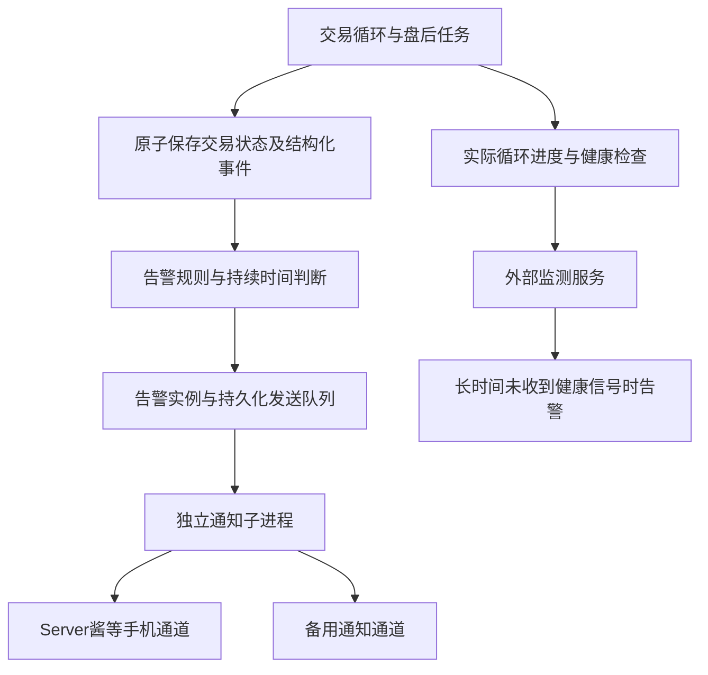

# P1：主动告警与常驻执行可靠性

> 状态：待实施（调研与设计）。
> 调研日期：2026-10-10，时区 Asia/Shanghai。
> 设计依据：[2967a6a](https://github.com/sanchez0623/ashare-limit-lens/commit/2967a6ab0b4f91a59b82baf0f0e884a11ada85be)。
> 文档入口：[统一索引](../README.md)。

建议先实施这项改进：为执行错误、异常阻塞、风险处置和盘后失败建立事件告警，再用不依赖本机的监测服务发现整机离线。交易、告警和外部监测各有自己的健康状态。本文交付方案，没有配置真实收件人、发送测试通知或创建监测账户。

## 1. 现状与缺口

| 代码位置                                                             | 核查结果                                                                                 | 实现要求                                                                         |
| -------------------------------------------------------------------- | ---------------------------------------------------------------------------------------- | -------------------------------------------------------------------------------- |
| [`scripts/trading-runner.mjs`](../../scripts/trading-runner.mjs)     | 循环捕获异常后尝试覆盖 heartbeat；没有通知通道。`pollTrading()` 的返回值没有用于分类处理 | 同时检查抛出的异常和返回的 `ERROR/BLOCKED/STALE_QUOTES`，不能只在 catch 中加推送 |
| [`backend/services/realtime.js`](../../backend/services/realtime.js) | 多数故障被转换为状态对象；有至少一只股票报价新鲜就可能显示 `RUNNING`                     | 检查每只持仓和保护订单需要的报价，不以整体 `RUNNING` 证明所有股票正常            |
| [`backend/storage/realtime.js`](../../backend/storage/realtime.js)   | heartbeat 只保留最新值；账户、会话和成交通过 CAS 原子提交                                | heartbeat 保持最新状态；增加追加事件、告警实例和持久化发送队列                   |
| [`backend/domain/realtime.js`](../../backend/domain/realtime.js)     | `BLOCKED` 可表示 T+1、涨跌停、成交量不足等；风险触发反映在订单和账本中                   | 使用结构化原因分类，区分交易约束、风险事件和程序故障                             |
| [`backend/services/paper.js`](../../backend/services/paper.js)       | 盘后任务可能返回失败对象，而不是抛异常                                                   | 同时检查结算、事前快照和下一日计划，不能仅判断 HTTP 200                          |
| [`server.mjs`](../../server.mjs)                                     | 秒级循环运行在本机服务；本机与网站 D1 独立                                               | 告警明确标识实例/账户，不混用网站账户状态来证明本机健康                          |

因此缺口不仅是缺少“发消息”：还缺少稳定事件、原因分类、去重、恢复通知和独立离线探测。进程挂起、电脑断电或网络中断时，本机已经没有能力主动发消息。

## 2. 推荐架构



交易循环不等待通知供应商响应。独立子进程可以在主 Node 事件循环阻塞时继续检测与通知，但仍处于同一电脑，不能替代外部监测。外部监测只接收最小健康信号，不开放本机数据库、交易 API 或公网端口。

### 2.1 通道选择

| 方案              | 适用性                                        | 取舍                                                                            |
| ----------------- | --------------------------------------------- | ------------------------------------------------------------------------------- |
| Server酱 Turbo    | 个人手机/微信通知，建议作为首个业务告警适配器 | HTTP 接入简单；需用户配置 SendKey 和接收通道，额度与可达性需要实际验证          |
| Healthchecks.io   | 整机离线、循环无进度的外部监测，建议首期使用  | 本机向外上报，超时由服务端通知；可配置独立邮件/其他集成，不依赖本机在线         |
| 企业微信机器人    | 已有企业微信群时的后续适配                    | 需要具备相应群与权限，不能假设普通个人微信群支持；上线前复核官方规则            |
| 自建外部 watchdog | 希望自主管理、需要交易日感知时                | 必须部署在另一台可用机器/云环境；需自行维护调度、日历和通知，不作为最低成本首选 |

Server酱官方文档提供 HTTP 推送和不同客户端通道，Turbo 与 Server酱³ 是不同产品，不能混用密钥。额度与频率以账户当前规则为准，不把某个免费额度写成永久能力。[Server酱文档](https://sct.ftqq.com/docs/)、[额度与通道说明](https://sct.ftqq.com/docs/getting-started/faq/)。本次搜索检索到了官方说明，但正文抓取超时；实施时须复核控制台与发送响应。

Healthchecks 支持按周期或 cron 等待信号，并在宽限时间之后判定失败；还可以显式上报失败。这符合整机失联的监测需求。[检查配置](https://healthchecks.io/docs/configuring_checks/)、[失败信号](https://healthchecks.io/docs/signaling_failures/)。它支持多种通知集成，建议至少配置两个独立落点，避免单一通道失效。[通知配置](https://healthchecks.io/docs/configuring_notifications/)。

不采用 GitHub Actions 作为秒级/分钟级 watchdog：仓库 CI 用于验证代码，不能承担常驻交易服务的及时失联探测。首期也不引入 Kafka、消息中间件或完整监控集群。

上线前需要在用户的 Windows 网络环境测试服务商 HTTPS 可达性与手机实际接收情况；本次云环境能访问文档，不证明本机通知链路已经可用。

## 3. 告警规则与默认阈值

阈值可由所有者配置并版本化，AI 不得自行降低或关闭。以下是系统建议值，不是供应商 SLA。

| 规则                      | 级别与建议触发条件                                                                   | 恢复条件                                                   |
| ------------------------- | ------------------------------------------------------------------------------------ | ---------------------------------------------------------- |
| `RUNNER_STALLED`          | 连续竞价期间，实际循环完成时间超过 `max(90 秒, 6 × 轮询间隔)` 未推进，CRITICAL       | 循环重新完成且持久化成功，至少两轮确认                     |
| `LOOP_FAILED`             | 连续 3 轮失败，且故障持续至少 30 秒，WARNING；持续 90 秒升级                         | 两轮成功，且故障原因已消失                                 |
| `SESSION_BLOCKED`         | 已确认交易日，但缺前日结算或事前计划等不可执行条件，立即 CRITICAL                    | 所需结算/计划可核对，交易会话真正恢复                      |
| `REQUIRED_QUOTE_STALE`    | 持仓/保护退出需要的某只报价连续 30 秒不可用，WARNING；60 秒且影响保护退出则 CRITICAL | 该股票重新获得日期、时间和价格都合格的报价                 |
| `DRAWDOWN_TRIPPED`        | 账户首次触及现有 10% 硬回撤约束，立即 CRITICAL                                       | 持续记录风险状态；不能仅因价格短暂反弹就宣布风险处置完成   |
| `PROTECTIVE_EXIT_BLOCKED` | 已触发保护退出但无法卖出，立即 WARNING；原因未明或持续影响已可卖仓位时升级           | 已完成风险退出，或明确记录仍受 T+1/停牌/跌停约束           |
| `T_RECOVERY_INCOMPLETE`   | 14:50 开始恢复后，14:55 仍有未完成第二腿，WARNING；盘后未完成再发摘要                | 恢复成交或已明确转为保护退出；不能把订单被取消当作风险恢复 |
| `SETTLEMENT_LATE`         | 确认交易日 15:20 仍未结算/归档/冻结下一计划，WARNING；15:30 CRITICAL                 | 三项均完成且账本核验一致                                   |
| `LEDGER_INVARIANT_FAILED` | 现金、成本或盈亏等式异常、无法重放，立即 CRITICAL                                    | 核验通过并有可追溯处置，不自动清空账户“修好”               |
| `ALERT_PIPELINE_STALLED`  | 分发器无进度或关键消息积压超过 2 分钟，外部监测告警                                  | 队列恢复处理且关键积压清除                                 |
| `AI_OR_RESEARCH_FAILED`   | AI 改进或历史研究任务失败，WARNING/盘后摘要                                          | 研究任务恢复；不标成交易系统停机                           |

### 3.1 不要对所有 BLOCKED 发同样的紧急告警

- 未满足买入触发线、买价超过事前上限、普通买单窗口结束：正常执行结果，保存记录即可。
- 当日新买股票不可卖：正常 T+1 约束；若已经触发止损，需要告知风险暂无法退出，而不是声称系统坏了。
- 涨停不能买入：预期约束；通常只纳入执行摘要。
- 跌停或停牌导致保护退出无法成交：属于真实风险暴露，需要通知，但不绕过约束虚构成交。
- 成交量不足、第一条报价建立基准：正常等待；持续影响保护退出才升级。
- 缺事前计划、缺前日结算、除权不匹配、账本异常：需要处理的运行阻塞，立即告警。

原因需使用枚举，例如 `T1_UNAVAILABLE/LIMIT_UP/LIMIT_DOWN/NO_LIQUIDITY/MISSING_PLAN/MISSING_SETTLEMENT/CORPORATE_ACTION_UNVERIFIED`。中文 reason 只用于展示，不能由告警器解析中文字符串判断严重程度。

### 3.2 日历与时段

所有规则使用 `Asia/Shanghai`：09:30–11:30、13:00–14:57 评价实时成交进度，午休不把不成交视为故障；14:50 后关注 T 补腿，15:05 后关注结算。

区分“交易所确认休市”“正常午休”和“交易日历不可用”。日历无法确认不是自动按休市处理，应产生独立 WARNING。节假日不要求交易报价更新或盘后结算，但电脑和服务的 24 小时可用性仍由外部监测检查。

冷启动/首次启动提供短暂预热宽限，不因为尚未获取第二条报价就告警；没有配置告警通道时明确显示“主动告警未启用”，不能显示健康保护已就绪。

## 4. 外部失联监测

### 4.1 首期两个独立检查

1. `PROCESS_PROGRESS`：目标每 60 秒发送一个健康信号，周期 60 秒、宽限 120 秒，缺信号约 3 分钟后由外部服务发通知。仅在读取到新的主进程实际循环进度、且基础存储检查通过时发送成功信号。
2. `ALERT_PIPELINE`：检测通知子进程是否实际推进、关键 outbox 是否积压。只有状态满足规则时发送健康信号；失败可显式上报或停止成功上报。

健康信号只能包含实例别名、角色、递增序号与最小状态；不发送持仓、现金、股票列表、供应商 URL 或错误堆栈。Ping URL 是具有调用能力的秘密，不能写入 Git、前端、普通日志或页面链接。

告警子进程不能每分钟无条件替交易主进程报平安；它必须检查主进程提供的递增工作序号和完成时间。同理，网页服务能打开，不等于交易循环有进度。

主进程返回了错误但仍在运行时，`PROCESS_PROGRESS` 可能正常，业务告警仍必须由本地规则触发；两个检查只证明各自监测的条件，不证明整个交易系统无故障。发生数据库错误无法持久化时，不继续发送基础存储正常的信号。

### 4.2 交易时段 watchdog 的扩展

后续可增加独立的 `TRADING_READY` 外部检查：使用交易日历与两个连续竞价区间，要求最新合格观测/提交序号推进。日历应提前保存到外部实例，本机停机后也能判断是否应交易。

仅设置“周一至周五” cron 会在国庆等工作日假期产生误报。若服务商不能表达交易日例外，需使用经验证的暂停排期，或自建外部日历感知检查器。网站当前盘后任务不能代替这一检查。

已计划维护需要所有者事前设置有期限的维护窗口；不可无限静默。维护静默不覆盖账本错误和已经触发的风险事件。关机/停服务后的处理由外部检查的维护排期决定，不能依赖已停止的本机事后去暂停检查。

## 5. 事件、持久化队列与发送语义

### 5.1 结构化事件

```js
const event = {
  id: "instance:account:date:sequence:type:entity",
  instanceId,
  accountId,
  tradeDate,
  sourceSequence,
  type: "DRAWDOWN_TRIPPED",
  reasonCode,
  occurredAt,
  entityRef,
  safeFacts,
};
```

告警使用已提交的交易事实。风险触发等事件应随账户、会话和成交在同一个现有 CAS 守卫批次写入轻量事件表；账户提交冲突时不能发送未提交的成交/风险结论。告警规则、实例和发送队列随后异步处理，供应商网络失败不回滚交易。

heartbeat 负责最新状态；事件表负责历史事实。一般循环失败、盘后失败、分发器失败也产生结构化运维事件。某些故障无法写数据库时，由独立子进程暂存有限的紧急事件并尝试安全通知，同时停止相应健康成功信号，外部监测兜底。

### 5.2 新表

| 表                      | 关键字段与约束                                                                                                                                 | 作用                                          |
| ----------------------- | ---------------------------------------------------------------------------------------------------------------------------------------------- | --------------------------------------------- |
| `operation_events`      | `id PK, instance_id, account_id, trade_date, source_sequence, type, reason_code, occurred_at, payload`                                         | 追加事实；源事件 ID 幂等                      |
| `alert_rule_versions`   | `id PK, created_at, payload, digest`                                                                                                           | 所有者告警阈值与路由规则的不可变版本          |
| `alert_incidents`       | `id PK, fingerprint, generation, status, severity, first_seen, last_seen, ack_until, resolved_at, rule_version, revision`                      | 同一问题的一次持续事件；活动 fingerprint 唯一 |
| `alert_events`          | `(incident_id, sequence) PK, type, created_at, payload`                                                                                        | 首次、升级、提醒、确认、恢复的追加审计        |
| `alert_outbox`          | `id PK, incident_id, event_sequence, channel_ref, status, attempt, next_attempt_at, lease_until, lease_owner, provider_ref`；事件/通道组合唯一 | 有界重试与重启恢复，不保存密钥                |
| `alert_processor_state` | `id PK, revision, last_event_cursor, last_progress_at, last_run_id`                                                                            | 消费游标、分发器与规则执行器健康              |

SQLite 继续使用事务，D1 使用项目现有 revision/CAS + nonce batch。原因去重以结构化枚举和实体为准，不使用可能带敏感信息的原始异常文本做 fingerprint。

### 5.3 生命周期与去重

```text
首次满足条件 -> OPEN -> 严重程度升级 / 有限提醒
                            -> ACK（确认，不代表恢复）
条件真正消失 -> RESOLVED -> 一次恢复通知
再次出现     -> 新 generation，新的 OPEN
```

建议同一问题先通知一次，持续 5 分钟可升级一次，之后每 15 分钟提醒，恢复通知一次；均受通道预算约束。高优先级事件保留发送额度，普通成交不逐笔推送，盘后摘要优先级低于关键故障。

去重与次数状态持久化，重启不能清零。一条行情源故障同时影响主账户和多个影子账户时按根因聚合，摘要列出受影响角色，避免一条故障变成几十条消息。影子研究失败默认 WARNING，不能和主账户停止交易混为一谈。

已确认的事件仍显示未恢复；确认可以有限期静默提醒，但新的严重程度升级仍通知。未曾成功通知就恢复的问题，在恢复后发送简短“发生并恢复”摘要；不能只发一条莫名的恢复消息。

### 5.4 异步发送与重试

- 通知任务运行在独立子进程；网络请求设短超时、禁止凭据随重定向转发。
- outbox 先领取有期限的租约，按每个通道限流发送；租约超时可由后续执行器接管。
- HTTP 200 不等于业务成功，依据供应商业务响应判断，并仅保存安全的消息引用。
- 建议退避 5 秒、30 秒、2 分钟、10 分钟，带小幅抖动；处理 429/Retry-After、服务错误和配置错误，避免无限快速重试。
- 配置错误不重复撞接口；关键通知可切备用通道，分发故障进入外部检查。
- 重启后先判断消息是否过期，旧问题已恢复则合并为摘要，不能补发几十条过时故障。
- API 接收消息不等于手机已经显示或用户已经阅读；界面分别显示排队、服务商接收、失败和用户确认。

网络超时可能发生在服务商已经接收之后，故不能承诺严格恰好一次。优先使用供应商提供的幂等能力；没有时允许少量重复并携带事件编号。通知重试绝不重放交易指令或金融扣款。

## 6. 模块和接入点

```text
backend/domain/
  alert-rules.js          结构化原因、时段、持续时间、严重程度与恢复判定
  alert-messages.js       最小消息模板、脱敏、fingerprint
backend/storage/
  alerts.js               事件、游标、告警状态 CAS、outbox 租约
backend/services/
  alerts.js               从已提交事实推进规则与告警实例
  notifications.js        有限的服务商适配接口
  watchdog.js             主进程进度与外部健康信号
scripts/
  alert-runner.mjs        独立告警子进程；不能阻塞交易循环
frontend/
  alerts.js               告警面板、确认、通道状态与测试入口
test/
  alerts.test.mjs
  watchdog.test.mjs
```

主要接口：

```js
classifyOperationalFacts(input);
evaluateAlertRules({ facts, previousIncident, policy, marketContext });
transitionIncident({ incident, evaluation, now });
formatSafeNotification({ event, instanceAlias, privacyMode });
claimDelivery({ channelRef, now, leaseOwner });
sendNotification({ channelConfig, safeMessage, eventId });
evaluateWatchdogHealth({ runnerProgress, storageHealth, queueHealth, now });
```

修改 `trading-runner.mjs` 时保留串行循环，保存 `pollTrading` 和 `runDaily` 的结果，把已提交状态交给规则器；不能把正常 `NON_TRADING_DAY` 当失败。当前 runner 的 catch 仍保留兜底，但不再是唯一告警入口。

修改纯交易函数时只增加结构化事件/原因字段；不在领域层调用 HTTP、写日志或发送通知。存储层负责事件与交易提交的守卫一致性。新增服务端环境变量在 `server.mjs` 显式传入后台服务，不能假设 `.env` 新字段自动出现在 worker 的 `env`。

## 7. 配置、接口与信息保护

建议配置项：

```text
ALERTS_ENABLED
ALERT_CHANNEL=serverchan
SERVERCHAN_SENDKEY=服务端秘密
WATCHDOG_PROGRESS_URL=服务端秘密
WATCHDOG_PIPELINE_URL=服务端秘密
ALERT_INSTANCE_ALIAS=windows-paper
```

仅非秘密规则保存在配置表；服务商 Key、带密钥的 webhook、Ping URL 在服务端 `.env`/秘密配置中保存。前端只看到通道名称和 `configured: true/false`，不能查看、导出或在页面 URL 中携带密钥。

| 接口                                   | 内容                                                       |
| -------------------------------------- | ---------------------------------------------------------- |
| `GET /api/alerts/status`               | 当前通道配置状态、积压、外部信号健康、规则版本             |
| `GET /api/alerts/incidents?cursor=...` | 分页查看事件及首次/升级/恢复                               |
| `POST /api/alerts/incidents/:id/ack`   | 所有者确认、有限期限静默；不修改交易状态                   |
| `POST /api/alerts/rules`               | 新规则版本，仅合法范围，AI 无写权限                        |
| `POST /api/alerts/test`                | 用户主动点击后发送明确标注的测试通知，鉴权、同源检查、限频 |
| `POST /api/alerts/maintenance`         | 有期限的计划维护，留下操作记录                             |

默认消息包含：实例别名、告警级别、事件类型、北京时间、持续时间和处理入口。股票代码可由所有者选择是否显示；默认不包含资产金额、持仓数量、真实账户标识、原始 URL、Key 或堆栈。指向本机的链接仅作本机入口，不宣称手机远程可打开。

服务商端点固定白名单；不提供任意 URL 转发接口。规则阈值、冷却时间和维护期做范围检查，避免误配置无限静默。日志仅输出事件 ID、通道代号与安全错误码，API Key 不参与错误详情或哈希输入。

## 8. 验证与分阶段交付

| 场景                                   | 验收标准                                            |
| -------------------------------------- | --------------------------------------------------- |
| 单轮错误后恢复                         | 不刷屏；按持续时间规则决定是否通知                  |
| 连续 `ERROR` 返回而未抛异常            | 仍能告警，覆盖当前最容易漏掉的路径                  |
| 一只关键持仓报价陈旧，其他股票正常     | 不被整体 `RUNNING` 掩盖                             |
| T+1、涨停、跌停、未触发                | 原因正确分类；不会把正常等待都标为停机              |
| 10% 回撤与保护退出                     | 首次触发立即入队；消息准确说明触发和成交状态        |
| 盘后返回失败对象                       | 到时触发迟延告警；不会把 HTTP 200 当完成            |
| 断网、电脑停机、主进程死锁             | 本机不能发消息时，独立外部检查仍能触发              |
| 告警子进程退出、队列积压、数据库不可写 | 不继续报告告警管道健康，外部监测发现                |
| 服务商超时/429/200 业务失败            | 重试和备用路径正确，不阻塞 10 秒交易、不重复成交    |
| CAS 冲突、重启、租约到期、快速反复故障 | 去重与恢复状态持久化，事件和 outbox 不丢失          |
| 午休、长假、日历未知、维护到期         | 按语义处理，不误报或无限静默                        |
| 手机实测与隐私检查                     | 两个通知落点实际收到；消息、日志、API、Git 不含凭据 |

先做结构化事件、规则和 outbox，再接入一个业务通知通道；随后配置外部失联监测、备用通道和恢复通知，完成停机/断网演练。只完成本地推送而没有外部检查，不满足“常驻系统不静默失联”的验收目标。

单元测试使用供应商适配器替身、可控时钟和内存数据库；真实通知只能在用户配置收件人并主动触发测试后验证。断网演练在测试实例进行，不影响已有模拟账户。

## 9. 与其他设计的关系

[AI 策略改进与前瞻验证](ai-strategy-walk-forward.md) 的影子阶段可复用告警机制：行情不完整、实验失效和启用失败进入事件流，但降低为研究告警或聚合摘要。

[历史冷启动](historical-cold-start.md) 的下载/回测任务使用低优先级告警，不能挤占主账户风险通知额度。历史任务运行在独立进程，告警同时监督它是否拖慢交易进度。

功能状态只有在真实通道、外部失联和恢复演练完成后才改为已实施；代码格式通过不等于手机通知链路已经验证。
